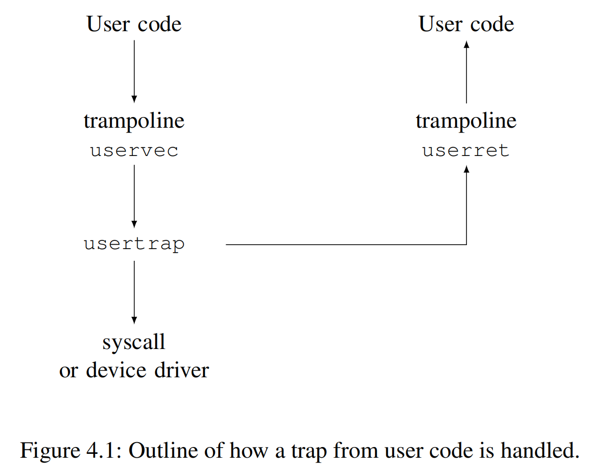

# 第 4 章 陷阱和系统调用（Chapter 4 Traps and system call）

> There are three kinds of event which cause the CPU to set aside ordinary execution of instructions and force a transfer of control to special kernel code that handles the event. One situation is a system call, when a user program executes the `ecall` instruction to ask the kernel to do something for it. Another situation is an exception: an instruction (user or kernel) does something illegal, such as load from an invalid virtual address. The third situation is a device *interrupt*, when a device signals that it needs attention, for example when the disk hardware finishes a read or write request.

有三种事件会导致 CPU 暂停正常的指令执行，并强制将执行流转移到处理该事件的特殊的内核指令处。第一种情况是 “系统调用（system call）”，即用户程序执行 `ecall` 指令，发起对内核的请求，请求内核代替它执行某些操作。另一种情况是 “异常（exception）”：发生的场景是当一条（用户态或内核态的）指令执行了非法操作，例如访问（读取）了无效的虚拟地址。第三种情况是设备 *中断（interrupt）*，即设备主动发出信号，提醒处理器注意某个事件发生了，例如当磁盘硬件完成读写请求时。

> This book uses *trap* as a generic term for these situations. Typically whatever code was executing at the time of the trap will later need to resume, and shouldn’t need to be aware that anything special happened. That is, we often want traps to be transparent; this is particularly important for device interrupts, which the interrupted code typically doesn’t expect. A trap forces a transfer of control into the kernel; the kernel saves registers and other state so that execution can be resumed; the kernel executes appropriate handler code (e.g., a system call implementation or device driver); the kernel restores the saved state and returns from the trap; and the original code resumes where it left off.

在本书中使用 *陷阱（trap）* 作为这些情况的统称。通常，当 trap 发生时（被打断的）正在执行的指令序列稍后都需要恢复，并且从执行指令序列的角度来看并不需要知道发生了什么特殊情况。也就是说，我们通常希望 trap 是透明的；这对于设备中断尤其重要，因为被中断的代码通常对这种情况并没有预期。Trap 强制将（对 CPU 的）控制权转移给内核；内核保存寄存器和其他状态，以便将来恢复执行；内核执行适当的处​​理程序代码（例如，系统调用函数或设备驱动程序）；内核恢复保存过的状态并从 trap 返回；原先的代码从被中断处继续恢复执行。

> Xv6 handles all traps in the kernel; traps are not delivered to user code. Handling traps in the kernel is natural for system calls. It makes sense for interrupts since isolation demands that only the kernel be allowed to use devices, and because the kernel is able to share devices among multiple processes. It also makes sense for exceptions since the kernel may be able to handle the exception from user space (for an example see Chapter 5) or respond by killing the offending program.

对于 xv6 来说，所有的 trap 处理都在内核中；也就是说，我们不会在用户态下执行 trap 的处理代码。这对于系统调用来说是很自然的事情。对于中断来说，也很有意义，因为这实现了隔离，确保只有在内核态才可以直接访问设备，所以我们可以把内核看成是一种供多个进程共享的访问设备的机制。异常也是内核需要重点处理的 trap 类型，内核需要正确处理来自用户空间的异常（具体例子请参考第 5 章的介绍），除此之外，内核只是简单地终止（kill）触发异常的进程。

> Xv6 trap handling proceeds in four stages: hardware actions taken by the RISC-V CPU, some assembly instructions that prepare the way for kernel C code, a C function that decides what to do with the trap, and the system call or device-driver service routine. While commonality among the three trap types suggests that a kernel could handle all traps with a single code path, it turns out to be convenient to have separate code for two distinct cases: traps from user space, and traps from kernel space. Kernel code (assembler or C) that processes a trap is often called a handler; the first handler instructions are usually written in assembler (rather than C) and are sometimes called a *vector*.

xv6 的 trap 处理分为四个阶段：最开始是 RISC-V CPU 内部的硬件操作，然后执行一段为内核 C 代码做准备的汇编指令，接下来是决定如何处理 trap 的 C 函数，最终决定是调用系统调用函数还是设备驱动程序服务例程。虽然这三种 trap 类型的共性表明内核可以用同一条代码路径处理所有 trap，但实践证明，将 trap 处理按两种不同的情况分开，分别编写代码更为方便：具体是区分该 trap 来自用户空间还是来自内核空间。处理 trap 的内核代码（汇编语言或 C 语言）通常被称为 “处理程序（handler）”；处理程序中最开始的一段指令通常用汇编语言（而不是 C 语言）编写，所以有时我们也把处理程序叫做 *向量（vector）*。

> Before proceeding, please read `kernel/trampoline.S`, and `usertrap()` and `prepare_return()` in `kernel/trap.c`.

在继续之前，请阅读 `kernel/trampoline.S`，以及 `kernel/trap.c` 中的 `usertrap()` 和 `prepare_return()`。

## 4.1 RISC-V 的陷阱机制（RISC-V trap machinery）

> Each RISC-V CPU has a set of hardware control registers that the kernel writes to tell the CPU how to handle traps, and that the kernel can read to find out about a trap that has occurred. The RISC-V documents contain the full story [3]. `riscv.h` (0500) contains definitions that xv6 uses. Here’s an outline of the most important registers:

每个 RISC-V CPU 都有一组硬件控制寄存器，内核通过设置这些寄存器来告诉 CPU 如何处理 trap，内核也可以读取这些寄存器来了解一个已发生的 trap。RISC-V 文档包含完整的内容 [3]。`riscv.h` (0500) 中定义了 xv6 所使用的和 RISC-V 相关的宏和 inline 函数。以下是一些最重要的寄存器的概述：

> - `stvec`: The kernel writes the address of its trap handler code here; the RISC-V jumps to the address in `stvec` to handle a trap.
> - `sepc`: When a trap occurs, RISC-V saves the program counter here (since the `pc` is then overwritten with the value in `stvec`). The `sret` (return from trap) instruction copies `sepc` to the `pc`. The kernel can write `sepc` to control where `sret` goes.
> - `scause`: RISC-V puts a number here that describes the reason for the trap.
> - `sscratch`: The kernel trap handler code uses `sscratch` to help it avoid overwriting user registers before saving them.
> - `sstatus`: The SIE bit in `sstatus` controls whether device interrupts are enabled. If the kernel clears SIE, the RISC-V will defer device interrupts until the kernel sets SIE. The SPP bit indicates whether a trap came from user mode or supervisor mode, and controls to what mode `sret` returns.

- `stvec`：内核在此处写入其 trap 处理程序的地址；RISC-V 会跳转到 `stvec` 中记录的地址来处理 trap。
- `sepc`：当一个 trap 发生时，RISC-V 会在此处保存 “程序计数器（program counter）” 的值（因为当 trap 发生时，`pc` 会被 `stvec` 中的值覆盖）。指令 `sret`（ret 是 return 的缩写，表示从 trap 返回）将 `sepc` 的值复制回 `pc` 中。内核可以设置 `sepc` 的值来控制执行 `sret` 后从哪里开始恢复取指执行。
- `scause`：RISC-V 在此处放置一个数字来描述 trap 发生的原因。
- `sscratch`：内核 trap 处理程序的代码使用 `sscratch` 来帮助其避免在保存用户寄存器之前覆盖它们。
- `sstatus`：`sstatus` 中的 SIE 比特位控制是否启用设备中断。如果内核清除了 SIE 比特位，RISC-V 将屏蔽设备中断，直到内核重新设置 SIE 比特位。SPP 比特位指示发生 trap 时机器处于用户模式还是管理员模式，从而控制执行 `sret` 时返回到哪个模式。

> The above registers can only be accessed in supervisor mode (i.e., by the kernel); the CPU prevents user code from reading or writing them.

上述寄存器只能在管理员模式下访问（也就是说只能被内核访问），在用户模式下它们无法被读取或写入。

> Each CPU on a multi-core chip has its own set of these registers, and more than one CPU may be handling a trap at any given time.

对于此类寄存器，在多核芯片上的每个 CPU 核都有一组，也就是说在任意给定时刻，每个 CPU 可以独立地处理自己的 trap。

> When it forces a trap, the RISC-V hardware does the following for all trap types:
>
> 1. If the trap is a device interrupt, and the `sstatus` SIE bit is clear, don’t do any of the following.
> 2. Disable interrupts by clearing the SIE bit in `sstatus`.
> 3. Copy the `pc` to `sepc`.
> 4. Save the current mode (user or supervisor) in the SPP bit in `sstatus`.
> 5. Set `scause` to a number indicating the trap’s cause.
> 6. Set the mode to supervisor.
> 7. Copy `stvec` to the `pc`.
> 8. Start executing at the new `pc`.

硬件针对各种 trap 类型的处理都是相同的，当一个 trap 发生时，RISC-V 处理器会按顺序执行以下动作：

1. 如果 trap 是设备中断，并且 `sstatus` 的 SIE 位已清零，则不会执行以下任何操作（译者注：即关中断情况下设备中断即使发生也不会触发 trap）。
2. 清除 `sstatus` 中的 SIE 比特位来禁用中断。
3. 将 `pc` 的值复制到寄存器 `sepc` 中。
4. 将当前模式（用户模式或管理员模式）保存在 `sstatus` 的 SPP 比特位中。
5. 给寄存器 `scause` 设置一个特定的值以反映 trap 发生的原因。
6. 将模式设置为管理员模式。
7. 用寄存器 `stvec` 中的值覆盖 `pc`。
8. 根据 `pc` 中新的指令地址取指执行。

> The CPU doesn’t switch to the kernel page table, doesn’t switch to a stack in the kernel, and doesn’t save any registers other than the `pc`. Kernel software must perform these tasks. One reason that the CPU does minimal work during a trap is to provide flexibility to software; for example, some operating systems omit a page table switch in some situations to increase trap performance.

（当 trap 发生时）CPU 不会自动切换为使用内核页表，也不会自动切换为使用内核栈，同时也不会保存除 `pc` 之外的任何寄存器。内核的代码必须自己执行这些操作。CPU 在 trap 发生期间只执行少量工作的原因之一是为软件实现提供灵活性；例如，某些操作系统在某些情况下可能会省略页表切换以提高执行 trap 的性能。

> It’s worth thinking about whether any of the steps listed above could be omitted, perhaps in search of faster traps. Though there are situations in which a simpler sequence can work, many of the steps would be dangerous to omit in general. For example, suppose that the CPU didn’t switch program counters. Then a trap from user space could switch to supervisor mode while still running user instructions. Those user instructions could break user/kernel isolation, for example by modifying the `satp` register to point to a page table that allowed accessing all of physical memory. It is thus important that the CPU switch to a kernel-specified instruction address, namely `stvec`.

这里我们可以深入思考一下，如果为了寻求更快的 trap 执行速度，（CPU 硬件）是否可以省略上面列出来的步骤中的任何一步。虽然在某些情况下可以使用更简单的执行步骤，但通常情况下，省略某些步骤是危险的。例如，假设 CPU 不切换 program counter。那么当在用户模式下发生 trap 时虽然模式已经切换到管理员模式，可是 CPU 仍然在执行用户指令。这些用户指令可能会破坏我们要保持用户和内核之间隔离的要求，譬如用户指令可以通过修改 `satp` 寄存器使其指向一个允许访问所有物理内存的页表。因此，由 CPU 来确保自动切换到内核指定的指令地址（即寄存器 `stvec` 中设定的值）是非常重要的。

## 4.2 用户空间触发的陷阱（Traps from user space）

> Xv6 handles traps differently depending on whether the trap occurs while executing in the kernel or in user code. Here is the story for traps from user code; Section 4.5 describes traps from kernel code.

在处理 trap 的方式上，xv6 区分 trap 发生在内核态还是在用户态。本小节介绍了当 trap 发生在用户态时的处理；第 4.5 节描述了 trap 发生在内核态时的处理。



> A trap may occur while executing in user space if the user program makes a system call (`ecall` instruction), or does something illegal, or if a device interrupts. As shown in Figure 4.1, the high-level path of a trap from user space is `uservec` (3071), then `usertrap` (3337); and when the kernel is ready to return, `usertrap` returns to `userret` (3151) which executes `sret` to user space.

如果用户程序在用户空间执行时发生系统调用（执行 `ecall` 指令），或执行了非法操作，或者发生设备中断，都会触发 trap。如图 4.1 所示，用户态 trap 的大致执行路径为：`uservec`（3071），然后是 `usertrap`（3337）；当内核准备返回时，`usertrap` 返回到 `userret`（3151）, `userret` 会执行 `sret` 返回用户空间。

> A major constraint on the design of xv6’s trap handling is the fact that the RISC-V hardware does not switch page tables when it forces a trap. This means that the trap handler address in `stvec` must have a valid mapping in the user page table, since that’s the page table in force when the trap handling code starts executing. Furthermore, xv6’s trap handling code needs to switch to the kernel page table; in order to be able to continue executing after that switch, the kernel page table must also have a mapping for the handler pointed to by `stvec`.

xv6 在 trap 处理设计上存在的一个主要限制在于，RISC-V 硬件在触发 trap 时不会自动切换页表。也就是说当 trap 处理程序的代码开始执行时当前激活的仍然是用户态的页表，所以这意味着 `stvec` 中所指向的 trap 处理程序的地址必须在用户页表中具备有效的映射。此外，xv6 的 trap 处理代码需要负责将页表切换为内核页表；为了能够在切换后能够继续执行，内核页表中对 `stvec` 所指向的 trap 处理程序也要具备有效的映射。

> Xv6 satisfies these requirements using a trampoline page. This page contains `uservec`, the xv6 trap handling code that `stvec` points to. The trampoline page is mapped in every process’s page table at virtual address `0x3ffffff000` (called `TRAMPOLINE`), which is the last page in the virtual address space so that it will be above memory that programs use for themselves. The trampoline page is mapped at the same virtual address in the kernel page table. See Figure 2.3 and Figure 3.3. Because the trampoline page is mapped in the user page table, traps can start executing there in supervisor mode. Because the trampoline page is mapped at the same address in the kernel address space, the trap handler can continue to execute after it switches to the kernel page table.

xv6 使用一个 “蹦床页（trampoline page）” 来满足以上要求。这个 trampoline page 中存放了 `uservec` 函数的指令，即 `stvec` 指向的 xv6 的 trap 处理程序。每个进程的页表（即用户页表）都会将这个 trampoline page 映射到进程地址空间中的虚拟地址 `0x3ffffff000` 处（这个地址在代码中定义为 `TRAMPOLINE`），这个 trampoline page 是虚拟地址空间的最后一个 page，因此它位于程序会使用的内存地址空间的最上方。trampoline page 在内核页表中被映射为相同的虚拟地址。参见图 2.3 和图 3.3。由于用户页表中有效映射了 trampoline page，因此当处理器进入管理员模式开始处理 trap 时可以从 `TRAMPOLINE` 那里开始执行。同时由于 trampoline page 也映射到内核地址空间中的相同地址，因此 trap 处理程序在切换到内核页表后依然可以继续执行。

> The code for the `uservec` trap handler is in `trampoline.S` (3071). When `uservec` starts, all 32 registers contain values owned by the interrupted user code. These 32 values need to be saved somewhere in memory, so that later on the kernel can restore them before returning to user space. Storing to memory requires use of a register to hold the store's destination address, but at this point there are no general-purpose registers available! Luckily RISC-V provides a helping hand in the form of the `sscratch` register. The `csrw` instruction at the start of `uservec` saves `a0` in `sscratch`. Now `uservec` has one register (`a0`) to play with.

`uservec` 函数（译者注：即用户态 trap 处理程序）的代码位于 `trampoline.S` 中 (3071) 。当 `uservec` 刚开始执行时，所有 32 个寄存器的值对应着被中断的用户程序的上下文。这 32 个值需要保存在内存中的某个位置，以便内核稍后在返回用户空间之前恢复它们。执行保存的操作需要使用寄存器来记录保存的目的地址，但目前没有可用的通用寄存器！（译者注：所有的通用寄存器的内容此时都需要保存，此时使用它们中的任何一个，都会修改它们的内容，这显然是不可以的）幸运的是，RISC-V 有一个 `sscratch` 寄存器可以提供帮助。`uservec` 函数中一开始利用 `csrw` 指令将 `a0` 保存在 `sscratch` 中。这样此时 `uservec` 至少有一个寄存器 (`a0`) 可以使用。

> uservec’s next task is to save the 32 user registers. The kernel allocates, for each process, a page of memory for a `trapframe` structure that (among other things) has space to save the 32 user registers (1992). Because `satp` still refers to the user page table, `uservec` needs the trapframe to be mapped in the user address space. Xv6 maps each process’s trapframe at virtual address `TRAPFRAME` (`0x3fffffe000`) in that process’s user page table; one page below `TRAMPOLINE`. Each process’s `p->trapframe` contains a kernel virtual address for the process’s trapframe.

`uservec` 的下一个任务是保存 32 个用户寄存器（译者注：严格说是 31 个，x0/zero 不需要保存和恢复）。内核为每个进程分配一个内存物理页（译者注：下文直接用 trapframe 指代这个物理页），用于存放 `trapframe` 结构体（以及其他一些内容），该结构体的部分空间用于保存 32 个用户寄存器 (1992)。由于 `satp` 此时仍然指向用户页表，`uservec` 需要将 trapframe 映射到用户地址空间。xv6 将每个进程的 trapframe 映射到该进程用户页表中的虚拟地址 `TRAPFRAME`（`0x3fffffe000`）；`TRAPFRAME` 就位于 `TRAMPOLINE` 的下方。每个进程的 `p->trapframe` 保存了自己的 trapframe 的内核虚拟地址。（译者注：内核代码中可以通过 `p->trapframe` 直接访问 trapframe，因为内核采用的是 direct mapping，具体参考 3.2 节）。

> `uservec` sets register `a0` to address `TRAPFRAME` and saves all the user registers there. Then it retrieves the user `a0` from `sscratch` and saves it in the trapframe.

因此，`uservec` 将地址 `TRAPFRAME` 设置到 `a0` 中（译者注：接上文，此时 `a0` 中原先的值已经保存在 `sscratch` 中），然后（根据这个地址）将所有用户寄存器保存在 trapframe 中。然后从 `sscratch` 取出备份的用户态 `a0` 并保存到 trapframe 中。

> The kernel previously initialized the trapframe to contain some values useful to `uservec`: the address of the current process’s kernel stack, the current CPU’s hartid, the address of the `usertrap` function, and the address of the kernel page table. `uservec` retrieves these values, switches `satp` to the kernel page table, and jumps to `usertrap`, a C function.

内核原先在 trapframe 中初始化了一些对 `uservec` 有用的数据，这包括：当前进程的内核栈地址、当前 CPU 的 hartid、`usertrap` 函数的地址以及内核页表地址，`uservec` 将读取和使用这些值，然后将 `satp` 切换到内核页表，并跳转到 `usertrap` (这是一个 C 函数)。

> The job of `usertrap` is to determine the cause of the trap, process it, and return (3337). It first changes `stvec` so that a trap while in the kernel will be handled by `kernelvec` rather than `uservec`. It saves the `sepc` register (the saved user program counter) for future use when returning back to user space. If the trap is a system call, `usertrap` calls `syscall` to handle it; if a device interrupt, `devintr`; if a page fault, `vmfault`; otherwise it’s an exception (e.g., use of an invalid address), and the kernel kills the faulting process. The system call path adds four to the saved user program counter because RISC-V, in the case of a system call, leaves the program pointer pointing to the `ecall` instruction but user code needs to resume executing at the subsequent instruction. `usertrap` checks if the process has been killed or should yield the CPU (if this trap is a timer interrupt).

`usertrap` 的工作包括确定 trap 发生的原因，进行相应处理然后返回 (3337)。它首先修改 `stvec` 的值，以便在内核态中一旦发生 trap 处理器会跳转到 `kernelvec` 而不是依然交给 `uservec` 处理。然后，它将 `sepc` 寄存器的值保存到 trapframe 中（`sepc` 的值是 trap 发生时的用户态下的 program counter），这是为了将来返回到用户空间所做的准备。接下来 `usertrap` 会判断，如果 trap 是系统调用，则调用 `syscall` 来处理；如果是设备中断，则调用 `devintr`；如果是 page fault，则调用 `vmfault`；其他情况是异常（譬如，访问了一个非法地址），内核会终止出错的进程。针对 RISC-V 的系统调用，我们并不会在这里直接修改处理器的 `sepc` 寄存器（即仍然让它指向调用 `ecall` 指令的地址），而是将已保存的用户态 program counter（译者注：即 `p->trapframe->epc`）的值加上 4，这么做的目的是确保系统调用执行完毕后，在返回用户态时，我们能从 `ecall` 指令的下一条指令处开始恢复执行（译者注：考虑到本节前面也说到 `usertrap` 中可能会发生进程切换返回用户态并修改 `sepc`，所以 `p->trapframe->epc` 的值只有在本进程真正确定需要返回用户态之前才会被恢复到 `sepc` 中，具体见下文针对 `usertrapret` 函数的解释）。`usertrap` 会检查进程是否已被终止或是否应该放弃 CPU（如果触发此 trap 的是定时器中断）。

> The first step in returning to user space is the call to `prepare_return` (3404). This function sets up the RISC-V control registers to prepare for a future trap from user space: setting `stvec` to `uservec` and preparing the trapframe fields that `uservec` relies on. `prepare_return` sets `sepc` to the previously saved user program counter. Finally, `usertrap` returns back to `userret` in the trampoline page (3151), passing back a pointer to the user page table in `a0`.

当我们开始准备返回用户空间的时候，第一步是调用 `prepare_return` (3404)。此函数设置 RISC-V 控制寄存器，为下一次用户空间的 trap 做好准备，这些准备工作包括：将 `stvec` 设置为 `uservec`，并为执行 `uservec` 准备好所需要的 trapframe。`prepare_return` 将 `sepc` 设置为先前保存的用户 program counter。最后，`usertrap` 返回 trampoline page 上的 `userret` (3151)，并通过 `a0` 传递了一个指向进程用户页表的指针。

> `userret` switches `satp` to the process’s user page table. Recall that the user page table maps both the trampoline page and `TRAPFRAME`, but nothing else from the kernel. The trampoline page mapping at the same virtual address in user and kernel page tables allows `userret` to keep executing after changing `satp`. From this point on, the only data `userret` can use is the register contents and the content of the trapframe. `userret` loads the `TRAPFRAME` address into `a0`, restores saved user registers from the trapframe via `a0`, restores the saved user `a0`, and executes `sret` to return to user space.

`userret` 将 `satp` 切换到进程的用户页表。回想一下，用户页表中只映射了 trampoline（映射到 `TRAMPOLINE`）和 trapframe（映射到 `TRAPFRAME`），除此之外，并没有映射内核的其他内容。由于 trampoline 在用户和内核页表中的虚拟地址相同，因此 `userret` 在更改 `satp` 后仍能继续执行。从此时起，`userret` 唯一可以使用的数据是寄存器内容和 trapframe 的内容。`userret` 先将 `TRAPFRAME` 地址加载到 `a0`，然后通过 `a0` 从 trapframe 恢复保存的（除 `a0` 之外其他的）用户寄存器，最后恢复保存的 `a0`，`userret` 最后通过执行 `sret` 返回用户空间。

> `uservec` and `userret` are written in assembly language because it is difficult to write C code to save or restore all the registers or survive switching page tables.

`uservec` 和 `userret` 是用汇编语言编写的，因为对于保存或恢复所有寄存器或切换页表这些操作很难用 C 代码来编写。

## 4.3 代码讲解：执行系统调用（Code: Calling system calls）

> User programs call library functions in order to make system calls. For example, the shell displays a prompt with this function call (in `user/sh.c`):

用户程序通过调用库函数来发起系统调用。例如，shell 应用程序通过以下函数调用打印一个提示符（在 `user/sh.c` 中）：

```c
write(2, "$ ", 2);
```

> Here’s the library function, in `user/usys.S`:

该库函数定义如下，具体定义在 `user/usys.S` 中：

```asm
write:
  li a7, SYS_write
  ecall
  ret
```

> The code that the C compiler generates for the function call loads the three arguments into registers `a0`, `a1`, and `a2`. Then the `write()` function loads the system call number, `SYS_write` (16), into `a7`. The kernel will look at those registers to find out what system call is intended, and what the arguments are. The `ecall` instruction traps from user space into the kernel and causes `uservec`, `usertrap`, and then `syscall` to execute.

C 编译器为这个函数调用生成相关的指令将三个参数分别存放在寄存器 `a0`、`a1` 和 `a2` 中。然后 `write()` 函数负责将系统调用号，即 `SYS_write`（其具体值为 16）放在 `a7` 中。内核会检查这些寄存器的值从而知道要执行哪个系统调用，以及传入的参数是多少。`ecall` 指令触发 trap，将处理器从用户态切换到内核态，并顺序执行 `uservec`、`usertrap` 和 `syscall`。

> At this point, please read `kernel/syscall.c`, `sys_write()` in `kernel/sysfile.c`, and `copyout()`, `copyin()`, and `copyinstr()` in `kernel/vm.c`.

此时，请阅读 `kernel/syscall.c`、`kernel/sysfile.c` 中的 `sys_write()` 以及 `kernel/vm.c` 中的 `copyout()`、`copyin()` 和 `copyinstr()`。

> `syscall` (3731) retrieves the system call number from the saved `a7` in the trapframe and uses it to index into `syscalls` (3706). For our example, `a7` contains `SYS_write` (3566), resulting in a call to the system call implementation function `sys_write`.

`syscall` (3731) 从 trapframe 中保存的 `a7` 中取到系统调用号，并用它作为索引在 `syscalls` 中找到对应的项。对于这里的例子代码，`a7` 的值是 `SYS_write` (3566)，所以最终会调用其对应的系统调用实现函数 `sys_write`。

> When `sys_write` returns, `syscall` records its return value in `p->trapframe->a0`. This will cause the original user-space call to `write()` to return that value, since the C calling convention on RISC-V places return values in `a0`. System calls conventionally return negative numbers to indicate errors, and zero or positive numbers for success.

当 `sys_write` 返回时，`syscall` 会将其返回值记录在 `p->trapframe->a0` 中。因为根据 RISC-V 上的 C 函数调用约定，规定将返回值放在 `a0` 中，所以这将导致原先用户空间对 `write()` 的调用返回该值。系统调用通常返回负数表示错误，返回零或正数表示成功。

## 4.4 代码讲解：系统调用参数（Code: System call arguments）

> System call arguments start out in the user registers, and are then moved to the trap frame by the kernel trap code. The kernel functions `argint`, `argaddr`, and `argfd` retrieve the *n*'th system call argument from the trap frame as an integer, pointer, or a file descriptor.

系统调用参数首先在用户态下被写入寄存器，然后由内核的 trap 处理代码移动到 trapframe 中。内核函数 `argint`、`argaddr` 和 `argfd` 从 trapframe 中找到第 *n* 个系统调用参数，再分别转化成整数、指针或文件描述符的形式。

> Some system calls pass pointers as arguments, and the kernel must use those pointers to read or write user memory. The `write` system call, for example, passes the kernel a user-space pointer to the data to be written. Such pointers pose two challenges. First, the user program may be buggy or malicious, and may pass the kernel an invalid pointer or a pointer intended to trick the kernel into accessing kernel memory instead of user memory. Second, the xv6 kernel page table mappings are not the same as the user page table mappings, so the kernel cannot use ordinary instructions to load or store from user-supplied addresses.

一些系统调用通过参数传递指针，内核需要使用这些指针来读取或写入用户内存。例如，`write` 系统调用向内核传递一个指针，该指针指向用户空间中存放有待写出数据的缓存。传递这样的指针带来了两个挑战。首先，用户程序可能存在缺陷或者纯粹怀有恶意，它们可能会向内核传递无效指针，或传递一个指针试图诱骗内核进而访问内核内存而不是用户内存。其次，由于 xv6 内核页表与用户页表的映射方式不同，因此内核无法直接使用普通指令根据用户提供的地址读取或存储数据。

> The kernel implements functions that safely transfer data to and from user-supplied addresses. `fetchstr` is an example (3624). File system calls such as `exec` use `fetchstr` to retrieve string file-name arguments from user space. `fetchstr` calls `copyinstr` to do the hard work.

内核实现了安全地根据用户提供的地址传输数据的函数。例如 `fetchstr` (3624)。诸如 `exec` 之类的系统调用通过使用 `fetchstr` 从用户空间获取字符串形式的文件名参数。`fetchstr` 中通过调用 `copyinstr` 来完成这项复杂的工作。

> `copyinstr` (1833) copies up to `max` bytes to `dst` from virtual address `srcva` in the user page table `pagetable`. Since `pagetable` is *not* the current page table, `copyinstr` uses `walkaddr` (which calls `walk`) to look up `srcva` in `pagetable`, yielding physical address `pa0`. The kernel’s page table maps all of physical RAM at virtual addresses that are equal to the RAM’s physical address. This allows `copyinstr` to directly copy string bytes from `pa0` to `dst`. `walkaddr` (1520) checks that the user-supplied virtual address is part of the process’s user address space, so programs cannot trick the kernel into reading other memory. A similar function, `copyout`, copies data from the kernel to a user-supplied address.

基于参数中给定的用户页表 `pagetable`，函数 `copyinstr` (1833) 将最多 `max` 个字节从用户态虚拟地址 `srcva` 复制到 `dst`。由于 `pagetable` *不是* 当前页表，`copyinstr` 使用 `walkaddr`（内部调用 `walk`）在 `pagetable` 中查找 `srcva`，从而得到物理地址 `pa0`。因为内核的页表将所有物理内存的地址映射到与其值相等的虚拟地址处。所以 `copyinstr` 可以直接将字符串字节从 `pa0` 复制到 `dst`。`walkaddr` (1520) 会检查用户提供的虚拟地址是否属于进程的用户地址空间，因此程序无法欺骗内核读取其他内存。类似的函数 `copyout` 将数据从内核空间复制到用户提供的地址。

## 4.5 内核空间触发的陷阱（Traps from kernel space）

> Please read `kernel/kernelvec.S`, and `kerneltrap()` in `kernel/trap.c`.

请阅读 `kernel/kernelvec.S` 和 `kernel/trap.c` 中的 `kerneltrap()`。

> Xv6 handles traps from kernel code in a different way than traps from user code. When entering the kernel, `usertrap` points `stvec` to the assembly code at `kernelvec` (3211). Since `kernelvec` only executes if xv6 was already in the kernel, `kernelvec` can rely on `satp` being set to the kernel page table, and on the stack pointer referring to a valid kernel stack. `kernelvec` pushes all 32 registers onto the current stack, from which it will later restore them so that the interrupted kernel code can resume without disturbance.

xv6 对于处理内核态 trap 的方式与处理用户态 trap 不同。进入内核时，`usertrap` 会将 `stvec` 指向汇编函数 `kernelvec`（3211）。由于 `kernelvec` 仅在 xv6 已进入内核后才会执行，因此当 `kernelvec` 被执行时我们知道 `satp` 已经设置为指向内核页表，以及栈指针也已经指向有效的内核栈（译者注：`uservec` 中跳转 `usertrap` 之前已经完成内核页表以及内核栈指针的设置）。`kernelvec` 会将所有 32 个寄存器压入当前栈，之后再从栈中恢复它们，以便被中断的内核代码能够不受干扰地恢复执行（译者注：原文这里所说的会将所有 32 个寄存器压栈的描述并不准确，实际只会保存 caller-saved 寄存器，具体见代码）。

> `kernelvec` saves the registers on the stack of the interrupted kernel thread, which makes sense because the register values belong to that thread. This is particularly important if the trap causes a switch to a different thread – in that case the trap will actually return from the stack of the new thread, leaving the interrupted thread’s saved registers safely on its stack.

`kernelvec` 将寄存器保存在被中断的内核线程的栈中，这么做是合理的，因为每个线程需要独立地保存一份自己被中断时的寄存器上下文信息。尤其重要的是我们需要意识到 trap 发生时可能导致线程切换，一旦发生线程切换，trap 返回时我们就可以从新线程的栈中恢复寄存器上下文，而同时被中断的线程的寄存器信息则被保存在自己的栈中，这也是安全的。

> `kernelvec` jumps to `kerneltrap` (3453) after saving registers. `kerneltrap` is prepared for just one type of trap: device interrupts. It calls `devintr` (3506) to handle them. If the trap isn’t a device interrupt, it must be an exception, such as kernel code trying to use an invalid pointer. This could only be caused by a bug in the kernel code. The kernel does not have a way to recover in this situation, so it calls `panic()`, which prints an error message and then halts.

保存好寄存器后，`kernelvec` 跳转到 `kerneltrap` (3453)。`kerneltrap` 只准备处理一种类型的 trap，即设备中断。它调用 `devintr` (3506) 来处理中断。如果 trap 不是设备中断，则一定是异常，譬如内核代码用到了一个非法指针。这只能说明内核代码中有错误发生。在这种情况下，内核无法恢复，所以对于内核的异常，内核会调用 `panic()` 打印出错信息然后停止内核的执行。

> If `kerneltrap` was called due to a timer interrupt, and a process’s kernel thread is running (as opposed to a scheduler thread), `kerneltrap` calls `yield` to give other threads a chance to run. At some point one of those threads will yield, and let our thread and its `kerneltrap` resume again. Chapter 8 explains what happens in `yield`.

对于定时器中断触发执行 `kerneltrap` 的情况，如果被打断的是普通的进程的内核线程（而不是调度器线程），`kerneltrap` 会调用 `yield` 让其他线程有机会运行。此后的某个时刻，当其他运行的线程中的某一个让出处理器时，我们这里先前让出处理器的线程会再次恢复运行并完成 `kerneltrap`。第 8 章将解释 `yield` 中发生的细节。

> When `kerneltrap`’s work is done, it needs to return to whatever code was interrupted by the trap. Because a `yield` may have disturbed `sepc` and the previous mode in `sstatus`, `kerneltrap` saves them when it starts. It now restores those control registers and returns to `kernelvec` (3237). `kernelvec` pops the saved registers from the stack and executes `sret`, which copies `sepc` to `pc` and resumes the interrupted kernel code.

当 `kerneltrap` 的工作完成后，它需要返回到被 trap 中断的代码。考虑到这期间可能发生过 `yield` 导致 `sepc` 和 `sstatus` 中原先存放的内容被修改，我们在刚进入 `kerneltrap` 时会保存它们的值。在 `kerneltrap` 的最后会恢复这些控制寄存器并返回到 `kernelvec` (3237)。`kernelvec` 会从栈中弹出保存的寄存器上下文并执行 `sret`，这条指令会将 `sepc` 复制到 `pc`，并恢复执行被中断的内核代码。

> Xv6 sets a CPU’s `stvec` to `kernelvec` when that CPU enters the kernel from user space; you can see this in `usertrap` (3346). But there’s a window of time when the kernel has started executing but `stvec` is still set to `uservec`, and it’s crucial that no device interrupt occur during that window. Luckily the RISC-V always disables interrupts when it starts to take a trap, and `usertrap` doesn’t enable them again until after it sets `stvec`.

当 CPU 从用户态进入内核时，xv6 会将 CPU 的 `stvec` 设置为 `kernelvec`；你可以在 `usertrap` (3346) 中看到这一点。但在内核开始执行后存在一个时间窗口期，在此期间 `stvec` 仍然指向 `uservec`，需要特别关注的一点是在此期间不能发生任何设备中断。所幸的是，RISC-V 规定当 trap 发生时硬件会自动禁用中断，而 `usertrap` 直到设置 `stvec` 后才会再次启用中断。

## 4.6 现实世界（Real world）

> The need for trampoline pages could be eliminated if kernel memory were mapped into every process’s user page table (with `PTE_U` clear). That would also eliminate the need for a page table switch when trapping from user space into the kernel. That in turn would allow system call implementations in the kernel to take advantage of the current process’s user memory being mapped, allowing kernel code to directly dereference user pointers. Many operating systems have used these ideas to increase efficiency. Xv6 avoids them in order to reduce the chances of security bugs in the kernel due to inadvertent use of user pointers, and to reduce some complexity that would be required to ensure that user and kernel virtual addresses don’t overlap.

如果将内核的内存在每个进程的用户页表中都进行映射（同时清除 `PTE_U` 标志位），则可以消除对特殊的 trapmpoline 页的需求。这也将消除从用户空间进入内核时进行页表切换的需要。同时这将允许内核在实现系统调用时利用当前进程映射的用户内存，从而允许内核代码直接利用传入的用户态指针访问内存。许多操作系统已经采用了这些想法来提高效率。xv6 避免了这些想法，以减少由于无意间错误使用用户指针而导致内核出现安全漏洞的可能性，并降低确为了保用户和内核虚拟地址不重叠而引入的复杂性。

4.7 练习（Exercises）

> 1. Could some or all of the code in `trampoline.S` and `kernelvec.S` be written in C rather than assembler?

1. `trampoline.S` 和 `kernelvec.S` 中的部分或全部代码可以改成用 C 语言编写而不是汇编语言编写吗？

> 2. Is there a way to eliminate the special `TRAPFRAME` page mapping in every user address space? For example, could `uservec` be modified to simply push the 32 user registers onto the kernel stack, or store them in the `proc` structure?

2. 有没有办法消除每个用户地址空间中对特殊的 TRAPFRAME 页的映射？例如，是否可以修改 `uservec`，将 32 个用户寄存器简单地保存到内核栈中，或者将它们存储在 `proc` 结构体中？

> 3. Could xv6 be modified to eliminate the special `TRAMPOLINE` page mapping?

3. 是否可以修改 xv6，消除针对 TRAMPOLINE 页的映射？
