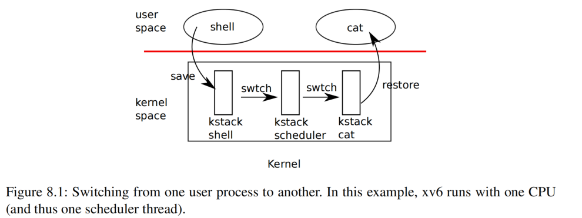
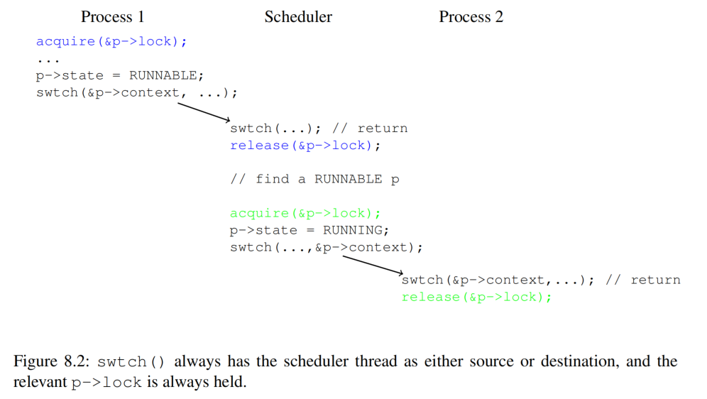

# 第 8 章 调度（Chapter 8 Scheduling）

> Any operating system is likely to run with more processes than the computer has CPUs, so a plan is needed to time-share the CPUs among the processes. Ideally the sharing would be transparent to user processes. A common approach is to provide each process with the illusion that it has its own virtual CPU by *multiplexing* the processes onto the hardware CPUs. This chapter explains how xv6 achieves this multiplexing.

一个操作系统上运行的进程数几乎总会超过计算机上处理器的数量，因此需要一个方案，在进程之间分时共享处理器。理想情况下，这种共享对用户进程透明。一种常见的方法是让进程 *复用（multiplex）* 硬件（处理器），让每个进程都感觉拥有自己专有的虚拟处理器。本章将解释 xv6 如何实现这种复用。

> Before proceeding with this chapter, please read `kernel/proc.h`, `kernel/swtch.S`, and `yield()`, `sched()`, and `schedule()` in `kernel/proc.c`.

在继续阅读本章之前，请先阅读 `kernel/proc.h`、`kernel/swtch.S` 以及 `kernel/proc.c` 中的 `yield()`、`sched()` 和 `schedule()`。

## 8.1 复用（Multiplexing）

> Xv6 multiplexes by switching each CPU from one process to another in two situations. First, xv6 switches when a process makes a system call that blocks (has to wait), for example `read` or `wait`. Second, xv6 periodically forces a switch to cope with processes that compute for long periods without blocking. The former are called voluntary switches, the latter involuntary.

xv6 会在两种情况下将一个处理器上的进程从一个切换到另一个来实现复用。一种情况是，一个进程调用了可能导致阻塞（必须等待）的系统调用，譬如 `read`、`wait`。另一种情况是，xv6 会定期进行强制切换，以应对那些计算密集且不发生阻塞的进程。前者属于主动切换；后者是被动切换。（译者注：multiplex 也可以翻译为 “多路复用”，这里的 “多路” 指多个进程复用一个处理器，本文直接翻译为 “复用”，简洁一点）。

> Implementing multiplexing poses a few challenges. First, how to switch from one process to another? The basic idea is to save and restore CPU registers, though the fact that this cannot be expressed in C makes it tricky. Second, how to force switches in a way that is transparent to user processes? Xv6 uses the standard technique in which a hardware timer’s interrupts drive context switches. Third, all of the CPUs switch among the same set of processes, so a locking plan is necessary to avoid mistakes such as two CPUs deciding to run the same process at the same time. Fourth, a process’s memory and other resources must be freed when the process exits, but it cannot finish all of this itself. Fifth, each CPU of a multi-core machine must remember which process it is executing so that system calls affect the correct process’s kernel state.

实现复用面临一些挑战。首先，如何从一个进程切换到另一个进程？基本思想是需要保存和恢复处理器的寄存器，但对于这些操作，由于无法用 C 语言编写，因此比较棘手。其次，如何对用户进程以透明的方式实现强制切换？xv6 采用的是常用的方法，即通过硬件定时器的中断触发上下文切换。第三，因为需要支持同一组进程在多个处理器之间切换，因此需要引入锁机制来避免两个 CPU 同时决定运行同一个进程等错误。第四，进程退出时必须释放其拥有的内存和其他资源，但它无法自行完成所有这些操作。第五，多核机器的每个处理器必须记住它正在执行哪个进程，以便系统调用能够确保只会涉及正确的进程及其内核的状态。

## 8.2 上下文切换概述（Context switch overview）

> The term “context switch” refers to the steps involved in a CPU leaving off execution of one kernel thread (usually for later resumption), and resuming execution of a different kernel thread; this switching is the heart of multiplexing. Xv6 does not directly context switch from one process’s kernel thread to another process’s kernel thread; instead, a kernel thread gives up the CPU by context-switching to that CPU’s “scheduler thread,” and the scheduler thread picks a different process’s kernel thread to run, and context-switches to that thread.

“上下文切换（context switch）” 是指 CPU 停止执行一个内核线程（通常是为了稍后恢复），并恢复执行另一个内核线程的操作步骤；这种切换是多路复用的核心。xv6 不会直接从一个进程的内核线程切换到另一个进程的内核线程；相反，内核线程会通过上下文切换到该 CPU 的 “调度线程（scheduler thread）” 来放弃 CPU，然后调度线程会选择另一个进程的内核线程来运行，并将上下文切换到该线程。

> At a broader scope, the steps involved in switching from one user process to another are illustrated in Figure 8.1: a trap (system call or interrupt) from the old process’s user space to its kernel thread, a context switch to the current CPU’s scheduler thread, a context switch to a new process’s kernel thread, and a trap return to the user-level process.

从更广泛的角度来看，图 8.1 说明了从一个用户进程切换到另一个用户进程所涉及的步骤：通过一个系统调用或中断从上一个进程的用户空间 “陷入（trap）” 到其内核线程、然后上下文切换到当前 CPU 的调度线程、再上下文切换到新进程的内核线程，最后通过 trap 返回到新进程的用户态。



## 8.3 代码讲解：上下文切换（Code: Context switching）

> The function `swtch()` in `kernel/swtch.S` contains the heart of thread context switching: it saves the switched-from thread’s CPU registers, and restores the previously-saved registers of the switched-to thread. The basic reason this is sufficient is that a thread’s state consist of data in memory (e.g. its stack) plus its CPU registers; thread memory need not saved and restored because different threads keep their data in different areas of RAM; but the CPU has only one set of registers so they must be switched (saved and restored) between threads.

`kernel/swtch.S` 中的 `swtch()` 函数是线程上下文切换的核心函数：它保存切换前上一个线程的 CPU 寄存器，并恢复切换后下一个目标线程先前保存的寄存器。这样做的基本原因是，线程的状态由内存中的数据（例如，线程的栈）加上其 CPU 寄存器组成；线程的内存数据无需保存和恢复，因为不同的线程将其数据保存在 RAM 的不同区域中；但 CPU 只有一组寄存器，因此必须在线程之间切换（保存和恢复）。

> Each thread’s `struct proc` includes a `struct context` that holds the thread’s saved registers when it is not running. A CPU’s scheduler thread’s `struct context` is in that CPU’s `struct cpu`. When thread X wishes to switch to thread Y, thread X calls `swtch(&X’s context, &Y’s context)`. `swtch()` saves the current CPU registers in X’s context, then loads the content of Y’s context into the CPU registers, then returns.

每个线程的 `struct proc` 都包含一个 `struct context`，用于存放当一个线程不在 CPU 上运行时需要保存的寄存器的内容。用于表示一个 CPU 的结构体 `struct cpu` 中也有一个 `struct context` 用于存放每个 CPU 对应的调度线程在其非运行时的需要保存的寄存器的内容。当线程 X 希望切换到线程 Y 时，线程 X 会调用 `swtch(&X’s context, &Y’s context)`。`swtch()` 在返回前将当前 CPU 的寄存器内容保存到 X 的上下文中，然后将 Y 上下文的内容加载到 CPU 寄存器中。

> Here’s an abbreviated copy of `swtch`:

下面是 `swtch` 函数的简略版本：

```asm
swtch:
        sd ra, 0(a0)
        sd sp, 8(a0)
        sd s0, 16(a0)
        ...
        sd s11, 104(a0)

        ld ra, 0(a1)
        ld sp, 8(a1)
        ld s0, 16(a1)
        ...
        ld s11, 104(a1)

        ret
```

> `a0` holds the first function argument, and `a1` the second; in this case, the two `struct context` pointers. `16(a0)` refers to an offset 16 bytes into the memory pointed to by `a0`; referring to the definition of `struct context` in `kernel/proc.h` (1951), this is the structure field called `s0`.

`a0` 保存第一个函数参数，`a1` 保存第二个函数参数；在本例中，是两个 `struct context` 类型的指针。`16(a0)` 指向的地址是以 `a0` 中的值为基地址加上 16 个字节的偏移量；参考 `kernel/proc.h` (1951) 中 `struct context` 的定义，也就是名为 `s0` 的结构体字段所在位置。

> Where does `swtch`’s `ret` return to? It returns to the instruction that the `ra` register points to. In the example in which thread X calls `swtch()` to switch to Y, when `ret` executes, `ra` has just been loaded from Y’s `struct context`. And the `ra` in Y’s `struct context` was originally saved by Y’s call to `swtch` when Y gave up the CPU in the past. So the `ret` returns to the instruction after the point at which Y called `swtch()`; that is, X’s call to `swtch()` returns as if returning from Y’s original call to `swtch()`. And `sp` will be Y’s stack pointer, since `swtch` loaded `sp` from Y’s `struct context`; thus on return, Y will execute on its own stack. `swtch()` need not directly save or restore the program counter; it’s enough to save and restore `ra`.

`swtch` 中的 `ret` 执行后程序会返回到哪里呢？它会返回到 `ra` 寄存器所指向的指令。在上述线程 X 调用 `swtch()` 切换到 Y 的例子中，当 `ret` 执行时，我们已经从 Y 的 `struct context` 中恢复了 `ra` 寄存器的值。而 Y 线程的 `struct context` 中的 `ra` 保存了先前 Y 在放弃 CPU 时调用 `swtch` 保存的值。因此 `ret` 会返回到 Y 调用 `swtch()` 之后的指令；也就是说，X 调用 `swtch()` 返回时，就像从 Y 最初调用 `swtch()` 返回一样。此外，由于 `swtch` 从 Y 的 `struct context` 中加载了 `sp`，因此 `sp` 将指向 Y 的栈；因此，返回时 Y 将在自己的栈上运行。`swtch()` 不需要直接保存或恢复 “程序计数器（program counter）”；只需保存和恢复 `ra` 就足够了。

> `swtch` (2902) saves callee-saved registers (`ra`,`sp`,`s0`..`s11`) but not caller-saved registers. The RISC-V calling convention requires that if code needs to preserve the value in a caller-saved register across a function call, the compiler must generate instructions that save the register to the stack before the function call, and restore from the stack when the function returns. So `swtch` can rely on the function that called it having already saved the caller-saved registers (either that, or the calling function didn’t need the values in the registers).

`swtch` (2902) 仅保存 “被调用方负责保存（callee-saved）” 的寄存器（譬如 `ra`、`sp`、`s0` .. `s11`），但不保存 “调用方负责保存（caller-saved）” 的寄存器。这是因为根据 RISC-V 规范定义的函数调用约定的要求，如果代码需要在调用某个函数前后使用某个 caller-saved 寄存器，则由编译器负责生成指令，在函数调用前将该寄存器的值保存到栈中，并在函数返回后从栈中恢复该寄存器。因此，`swtch` 可以认为调用它的函数已经保存了 caller-saved 寄存器（或者调用者本身不关心这些寄存器中的值，所以更没有保存这些寄存器的必要）。

## 8.4 代码讲解：调度（Code: Scheduling）

> The last section looked at the internals of `swtch`; now let’s take `swtch` as a given and examine switching from one process’s kernel thread through the scheduler to another process. The scheduler exists in the form of a special thread per CPU, each running the `scheduler` function. This function is in charge of choosing which process to run next. Each CPU has its own scheduler thread because more than one CPU may be looking for something to run at any given time. Process switching always goes through the scheduler thread, rather than direct from one process to another, to avoid some situations in which there would be no stack on which to execute the scheduler (e.g. if the old process has exited, or there is no other process that currently wants to run).

上一节介绍了 `swtch` 的内部实现；现在，我们以 `swtch` 为例，分析如何通过调度器（scheduler）从一个进程的内核线程切换到另一个进程。调度器在每个 CPU 上都安排了一个特殊的线程，这个特殊的线程运行 `scheduler` 函数（译者注，下文将调度器在每个 CPU 上安排的线程也称为 scheduler 线程或调度线程）。该函数负责选择下一个在该 CPU 上运行的进程。每个 CPU 都有自己的 scheduler 线程，因为在任意时刻，可能有多个 CPU 正在等待执行任务。进程切换总是通过调度线程进行，而不是直接从一个进程切换到另一个进程，以避免出现没有栈来执行调度程序的情况（例如，如果旧进程已经退出，而当前也没有其他进程想要运行）。

> A process that wants to give up the CPU must acquire its own process lock `p->lock`, release any other locks it is holding, update its own state (`p->state`), and then call `sched`. You can see this sequence in `yield` (2629), `sleep` and `kexit`. `sched` calls `swtch` to save the current context in `p->context` and switch to the scheduler context in `cpu->context`. `swtch` returns on the scheduler’s stack as though `scheduler`’s `swtch` had returned (2582). 

想要放弃 CPU 的进程必须先获取到自己的进程锁 `p->lock`，释放其持有的任何其他锁，更新自身状态（`p->state`），然后调用 `sched`。我们可以在 `yield` (2629)、`sleep` 和 `exit` 中看到上述类似的程序执行步骤。`sched` 调用 `swtch` 将当前上下文保存在 `p->context` 中，并根据 `cpu->context` 中的值切换到 scheduler 线程的上下文。`swtch` 在 scheduler 线程的栈上返回，具体返回地址在 `scheduler` 函数中 (2582)，看上去就好像 `scheduler` 中的 `swtch` 函数返回了一样。



> `scheduler` (2558) runs a loop: find a process to run, `swtch()` to it, eventually it will `swtch()` back to the scheduler, which continues its loop. The scheduler loops over the process table looking for a runnable process, one that has `p->state == RUNNABLE`. Once it finds a process, it sets the per-CPU current process variable `c->proc`, marks the process as `RUNNING`, and then calls `swtch` to start running it (2577-2582). At some point in the past, the target process must have called `swtch()`; the scheduler’s call to `swtch()` effectively returns from that earlier call. Figure 8.2 illustrates this pattern.

`scheduler` (2558) 通过一个循环来找到一个要运行的进程，然后通过调用 `swtch()` 切换到该进程，最终该进程也会通过调用 `swtch()` 将 CPU 返回给调度器，而调度器则继续运行这个循环。调度器在循环中遍历进程表，寻找一个可运行的进程，即 `p->state == RUNNABLE` 的进程。一旦找到一个（满足要求的）进程，它会将这个进程的句柄设置到当前 CPU 上用来记录当前运行进程的变量 `c->proc` 上，同时将该进程标记为 `RUNNING`，然后调用 `swtch` 开始运行它 (2577-2582)。在过去的某个时刻，该进程一定调用过 `swtch()`；调度器对 `swtch()` 的调用实际上会导致执行流从之前它调用 `swtch()` 处返回。图 8.2 说明了这种运行模式。

> xv6 holds `p->lock` across calls to `swtch`: the caller of `swtch` acquires the lock, but it’s released in the target after `swtch` returns. This arrangement is unusual: it’s more common for the thread that acquires a lock to also release it. Xv6’s context switching breaks this convention because `p->state` and `p->context` must be updated together atomically. For example, if `p->lock` were released before invoking `swtch`, a different CPU `c` might decide to run the process because its state is `RUNNABLE`. CPU `c` will invoke `swtch` which will restore from `p->context` while the original CPU is still saving into `p->context`. The result would be that the process would be restored with partially-saved registers on CPU `c` and that both CPUs will be using the same stack, which would cause chaos. Once `yield` has started to modify a running process’s state to make it `RUNNABLE`, `p->lock` must remain held until the process has saved all its registers and the scheduler is running on its stack. The earliest correct release point is after `scheduler` (running on its own stack) clears `c->proc`. Similarly, once `scheduler` starts to convert a `RUNNABLE` process to `RUNNING`, the lock cannot be released until the process’s kernel thread is completely running (after the `swtch`, for example in `yield`).

xv6 在调用 `swtch` 时会持有 `p->lock`：锁的获取由 `swtch` 的调用者负责，而释放则由目标线程在其从 `swtch` 返回后完成。这种安排并不常见：一般情况下获取锁的线程也负责释放。xv6 的上下文切换打破了这种惯例，因为我们必需要确保在更新 `p->state` 和 `p->context` 时不被打扰。例如，如果在调用 `swtch` 之前释放了 `p->lock`，另一个 CPU `c` 可能会决定运行该进程，因为它的状态是 `RUNNABLE`。CPU `c` 将调用 `swtch`，而 `swtch` 会根据 `p->context` 对上下文进行恢复，而此时原先得那个 CPU 仍在将数据写入到 `p->context` 中。结果造成，该进程针对 CPU `c` 所恢复的寄存器上下文信息并不完整，甚至两个 CPU 都使用相同的栈，这将导致混乱。所以对于一个正在运行的进程，一旦 `yield` 开始修改其状态，将其变为 `RUNNABLE`，`p->lock` 必须保持锁定，直到该进程保存了所有寄存器，并且调度器开始在其栈上运行。最早的正确释放时间点是在 `scheduler`（在其自己的栈上运行）清除 `c->proc` 之后。同样，一旦 `scheduler` 开始将 `RUNNABLE` 进程转换为 `RUNNING`，在该进程的内核线程完全运行之前（例如，在 `yield` 中的 `swtch` 之后），锁都不能被释放。

> There is one case when the scheduler’s call to `swtch` does not end up in `sched`. `allocproc` sets the context `ra` register of a new process to `forkret` (2653), so that its first `swtch` “returns” to the start of that function. `forkret` exists to release the `p->lock` and set up some control registers and trapframe fields that are required in order to return to user space. At the end, `forkret` simulates the normal return path from a system call back to user space.

存在一种例外，调度器在调用 `swtch` 后不会跳转到 `sched` 中。`allocproc` 将新进程的 `context.ra` 字段设置为 `forkret` (2653) 的地址，这样 `scheduler` 中第一次执行 `swtch` 时 “返回” 的位置将是 `forkret` 函数的首地址。`forkret` 的作用是释放 `p->lock`，并设置一些返回用户空间所需的控制寄存器和 trapframe 字段。最后，`forkret` 模拟了从系统调用返回用户空间的正常路径。

## 8.5 代码讲解：`mycpu` 和 `myproc`（Code: `mycpu` and `myproc`）

> Xv6 often needs a pointer to the current process’s `proc` structure. On a uniprocessor one could have a global variable pointing to the current `proc`. This doesn’t work on a multi-core machine, since each CPU executes a different process. The way to solve this problem is to exploit the fact that each CPU has its own set of registers.

xv6 中经常需要使用一个指向当前进程的 `proc` 结构体的指针。在单处理器上，可以定义一个指向当前 `proc` 的全局变量。但这在多核机器上行不通，因为每个 CPU 上当前执行的进程都不相同。解决这个问题的方法是利用每个 CPU 专属的那组寄存器。

> While a given CPU is executing in the kernel, xv6 ensures that the CPU’s `tp` register always holds the CPU’s hartid. RISC-V numbers its CPUs, giving each a unique hartid. `mycpu` (2178) uses `tp` to index an array of `cpu` structures and return the one for the current CPU. A `struct cpu` (1971) holds a pointer to the `proc` structure of the process currently running on that CPU (if any), saved registers for the CPU’s scheduler thread, and the count of nested spinlocks needed to manage interrupt disabling.

当一个给定的 CPU 在内核态下运行时，xv6 会确保 CPU 的 `tp` 寄存器始终保存该 CPU 的 hartid 的值。RISC-V 规定每个 CPU 都有一个唯一的 hartid 作为其编号。`mycpu` (2178) 使用 `tp` 的值来索引结构体 `cpu` 的数组，并返回当前 CPU 对应的结构体。`struct cpu` (1971) 的成员包括一个指向当前在该 CPU 上运行的进程（如果有）的结构体 `proc` 的指针（`cpu.proc`）；一个用于保存该 CPU 对应的 scheduler 线程的寄存器上下文的成员变量（`cpu.context`）；以及一个用于记录嵌套的自旋锁数量的成员变量（`cpu.noff`），这个成员变量可用于管理是否关闭中断。

> Ensuring that a CPU’s `tp` holds the CPU’s hartid is a little involved, since user code is free to modify `tp`. `start` sets the `tp` register early in the CPU’s boot sequence, while still in machine mode (1094). While preparing to return to user space, `prepare_return` saves `tp` in the trampoline page, in case user code modifies it. Finally, `uservec` restores that saved `tp` when entering the kernel from user space (3127). The compiler guarantees never to modify `tp` in kernel code. It would be more convenient if xv6 could ask the RISC-V hardware for the current hartid whenever needed, but RISC-V allows that only in machine mode, not in supervisor mode.

确保 CPU 的 `tp` 保存 CPU 的 hartid 有点复杂，因为用户态代码有权限自由修改 `tp`。在 CPU 启动的早期，`start` 会设置 `tp` 寄存器，此时 CPU 仍处于机器模式 (1094)。准备返回用户空间时，`prepare_return` 将 `tp` 保存在 trampoline 内存页中，以防用户代码修改它。最后，当进程从用户空间进入内核时 `uservec` 会恢复保存的 `tp` (3127)。编译器会保证永远不会在内核代码中修改 `tp`（译者注：这是 RISC-V ABI 的规定）。如果 xv6 可以随时在需要时向 RISC-V 硬件获取当前的 hartid 就更方便了，但 RISC-V 仅在机器模式下允许这样做，而在管理员模式下则不允许。

> The return values of `cpuid` and `mycpu` are fragile: if the timer were to interrupt and cause the thread to yield and later resume execution on a different CPU, a previously returned value would no longer be correct. To avoid this problem, xv6 requires code to disable interrupts before calling `cpuid()` or `mycpu()`, and only enable interrupts when done using the returned value.

`cpuid` 和 `mycpu` 的返回值需要被保护起来：因为定时器中断有可能会导致当前（调用了 `cpuid` 和 `mycpu` 的）线程放弃 CPU，而该线程稍后又在另一个 CPU 上恢复执行，则先前返回的值将不再正确。为了避免这个问题，xv6 要求代码在调用 `cpuid()` 或 `mycpu()` 之前禁用中断，并且仅在使用返回值完成后启用中断。

> The function `myproc` (2187) returns the `struct proc` pointer for the process that is running on the current CPU. `myproc` disables interrupts, invokes `mycpu`, fetches the current process pointer (`c->proc`) out of the `struct cpu`, and then enables interrupts. The return value of `myproc` is safe to use even if interrupts are enabled: if a timer interrupt moves the calling process to a different CPU, its `struct proc` pointer will stay the same.

函数 `myproc`（2187）返回当前 CPU 上运行的进程的 `struct proc` 指针。`myproc` 中会先禁用中断，然后调用 `mycpu`，从 `struct cpu` 中获取当前进程指针（`c->proc`），然后启用中断。虽然此时启用了中断，`myproc` 的返回值也是可以安全使用的：因为即使定时器中断将调用 `mycpu` 的进程移动到不同的 CPU，但此时获得的 `struct proc` 指针的值并不会被改变（译者注：可以这么理解，`myproc` 本质是一个进程找自己，如果已经找到自己后即使自己被迁移到别的 CPU 对结果也没有影响）。

## 8.6 现实世界（Real world）

> The xv6 scheduler implements a simple scheduling policy that runs each process in turn. This policy is called *round robin*. Real operating systems implement more sophisticated policies that, for example, allow processes to have priorities. The idea is that a runnable high-priority process will be preferred by the scheduler over a runnable low-priority process. These policies can become complex because there are often competing goals: for example, the operating system might also want to guarantee fairness and high throughput.

xv6 调度器实现了一个简单的调度策略，即依次运行每个进程。这个策略被称为 *轮转（round robin）*。真正的操作系统会实现更复杂的策略，例如允许进程拥有优先级。这么做的目的是允许调度器优先选择 “就绪（runnable）” 的高优先级进程，而不是就绪的低优先级进程。这些策略可能会变得复杂，因为通常存在相互冲突的目标：例如，操作系统可能希望在保证公平性的同时又维持高的吞吐量。

## 8.7 练习（Exercises）

> 1. Modify xv6 to use only one context switch when switching from one process’s kernel thread to another, rather than switching through the scheduler thread. The yielding thread will need to select the next thread itself and call `swtch`. The challenges will be to prevent multiple CPUs from executing the same thread accidentally; to get the locking right; and to avoid deadlocks.

1. 修改 xv6，使其在从一个进程的内核线程切换到另一个进程时仅使用一次上下文切换，而不是通过 scheduler 线程进行切换。放弃 CPU 的线程需要自行选择下一个线程并调用 `swtch`。挑战在于如何防止多个 CPU 意外执行同一个线程；如何正确锁定；以及如何避免死锁。
