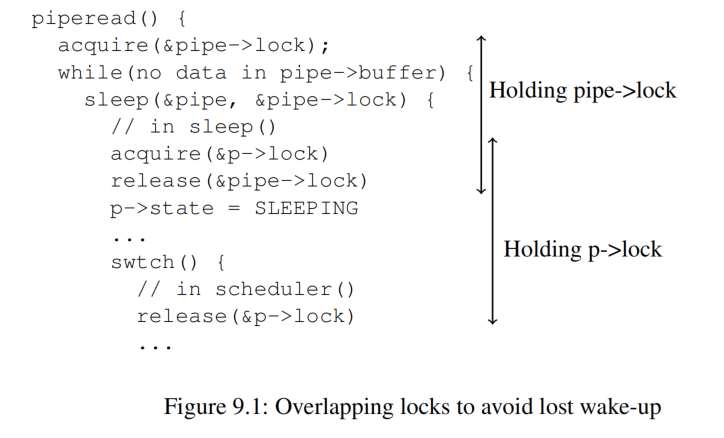

# 第 9 章 睡眠与唤醒（Chapter 9 Sleep and Wakeup）

> Scheduling and locks help conceal the actions of one thread from another, but we also need abstractions that help threads intentionally interact. For example, the reader of a pipe in xv6 may need to wait for a writing process to produce data; a parent’s call to `wait` may need to wait for a child to exit; and a process reading the disk needs to wait for the disk hardware to finish the read. The xv6 kernel uses a mechanism called sleep and wakeup in these situations (and many others). Sleep allows a kernel thread to wait for some condition to be true; another thread or an interrupt handler can cause the condition to be true (typically by modifying some variable(s)) and then call wakeup to indicate that threads waiting for the condition should resume. Sleep and wakeup are often called *sequence coordination* or *conditional synchronization* mechanisms.

调度和锁有助于隐藏线程之间的相互作用，但我们也需要一些明确的原语来表达线程之间有意识的交互。例如，xv6 中管道的 “读端（reader）”（译者注：即从管道中读取数据的进程，后面的 “写端” 同理）可能需要等待管道的 “写端（writer）” 写入数据；父进程调用 `wait` 等待子进程退出；读取磁盘的进程需要等待磁盘硬件完成读取。xv6 内核针对这些情况（以及许多其他情况）引入了一种称为 “睡眠（sleep）” 和 “唤醒（wakeup）” 的机制。“睡眠” 允许内核线程等待特定条件变成真；另一个线程或者中断处理函数负责将条件变为真（典型地通过修改一些变量）然后调用 “唤醒” 来通知处于等待该条件的线程恢复运行。“睡眠” 和 “唤醒” 通常被称为 *次序协调（sequence coordination）* 或 *条件同步（conditional synchronization）* 机制。

> Before proceeding, please read the functions `sleep()` and `wakeup()` in `kernel/proc.c`, and all of file `kernel/pipe.c`.

在继续之前，请阅读 `kernel/proc.c` 中的函数 `sleep()` 和 `wakeup()`，以及整个`kernel/pipe.c` 文件。

## 9.1 概述（Overview）

> The sleep/wakeup interface looks like:

“睡眠” 和 “唤醒” 函数的声明如下：

```c
void sleep(void *chan, struct spinlock *lk)
void wakeup(void *chan)
```

> `sleep()` marks the calling process as `SLEEPING` (not `RUNNABLE`) and releases the CPU by context-switching to the scheduler, so that other processes can run. The `chan` argument is called the *wait channel*. `wakeup(chan)` wakes up all processes (if any) that have called `sleep(chan, ...)` with the same `chan` value. `sleep` and `wakeup` treat `chan` as an opaque 64-bit value; the only thing they do with it is compare for equality. The usual pattern is for callers to pass the address of some convenient object as the `chan` argument.

`sleep()` 将调用进程标记为 `SLEEPING`（而非 `RUNNABLE`），并通过上下文切换到调度程序释放 CPU，以便其他进程可以运行。参数 `chan` 称为 *等待通道（wait channel）*。`wakeup(chan)` 会唤醒所有使用相同 `chan` 值调用 `sleep(chan, ...)` 的进程（如果没有则什么也不做）。`sleep` 和 `wakeup` 并不关心 `chan` 具体是什么，对于它们来说 `chan` 只是一个64 位的值；对 `chan` 的唯一处理操作是比较其相等性。通常情况下调用者会将某个对象的地址作为实参传入 `chan`。

> Kernel code calls `sleep` to wait for some *condition* to become true. For example, the kernel code that reads from a pipe calls `sleep` if the pipe buffer is currently empty; the condition in this case is the pipe buffer becoming non-empty (due to another process writing to the pipe). `sleep` and `wakeup` do not know what the condition is: only the calling code knows. The usual pattern is for the caller to first check the condition, and call `sleep` if it is not true; code that later makes the condition true calls `wakeup`.

内核代码调用 `sleep` 来等待某些 *条件* 变为真。例如，如果当前管道的缓冲区为空，则从管道读取数据的内核代码会调用 `sleep`；在这种情况下，等待的条件是管道缓冲区变为非空（另一个进程会写入管道）。`sleep` 和 `wakeup` 并不关心条件是什么：只有调用代码知道。通常的模式是，调用者首先检查条件，如果条件不成立，则调用 `sleep`；之后使条件成立的代码会调用 `wakeup`。

> Here’s a sketch of how the xv6 kernel pipe code uses `sleep` and `wakeup`:

下面是 xv6 内核中实现管道的代码使用 `sleep` 和 `wakeup` 的简单示例：

```c
piperead(pipe) {
  acquire(&pipe->lock);
  while(there’s no data in pipe->buffer){
    // ZZZ
    sleep(&pipe, &pipe->lock);
  }
  remove the data from the pipe;
  release(&pipe->lock);
}

pipewrite(pipe) {
  acquire(&pipe->lock);
  append data to pipe->buffer;
  wakeup(&pipe);
  release(&pipe->lock);
}
```

> This code uses the address of the pipe data structure as the wait channel.

此代码使用管道结构体对象的地址作为等待通道。

> What is the `lk` argument to `sleep`? In all uses of `sleep`/`wakeup` the condition involves shared data, used by both the thread that sleeps and the thread that calls `wakeup`, so there always turns out to be a lock that protects the condition. That lock is called the *condition lock*. In the pipe code above, both functions use the pipe and its buffer while holding the pipe lock, which in this case is also the condition lock. It’s a rule that any code that calls `sleep` or `wakeup` must hold the condition lock, and that the lock must be passed to `sleep` as the second argument.

`sleep` 的参数 `lk` 又是做什么用的呢？在所有 `sleep`/`wakeup` 的使用中，涉及的等待条件都和共享数据有关，这些数据被需要休眠的线程和调用 `wakeup` 的线程（译者注，负责唤醒睡眠线程）使用，因此总会需要有一个锁来保护这个等待条件。因此这个锁被称为 *条件锁（condition lock）*。在上面的管道实现代码中，两个函数都需要在持有管道锁的前提下使用管道及其缓冲区，这里的锁就是我们说的条件锁。因此处理原则是，任何调用 `sleep` 或 `wakeup` 的代码都必须持有条件锁，并且必须将该锁作为第二个参数传递给 `sleep`。

> The reason that the condition lock must be held when `sleep` is called, and that it must be passed to `sleep`, is to prevent the possibility that another thread might call `wakeup` between the check of the condition and the call to `sleep`. A call to `wakeup` at that point would find no sleeping process to wake up; the `wakeup` would simply return. But then the call to `sleep` might never wake up, since the `wakeup` intended for it has already happened. This undesirable situation is called a *lost wake-up*.

之所以在调用 `sleep` 时必须持有条件锁，并且必须将锁传递给 `sleep`，这是考虑到我们需要避免一种情况，就是在检查条件和调用 `sleep` 之间，另一个线程可能会调用 `wakeup`（译者注：简单来说，就是在调用 `sleep` 之前提前发生了 `wakeup`）。此时调用 `wakeup` 将找不到任何可唤醒的休眠进程；也就是说在这种情况下 `wakeup` 什么也做不了。这会导致 `sleep` 调用可能永远不会被唤醒，因为预期的 `wakeup` 已经发生（但什么也没有做）。对于这种我们不希望看到的情况我们将其称为 *丢失唤醒（lost wake-up）*。

> In the pipe example above, the lost wake-up being avoided is the possibility that a thread on another CPU might call `pipewrite` at the point marked `ZZZ`, between `piperead`’s check of the condition and its call to `sleep`. The fact that `piperead` holds the pipe lock during the time between when it checks the condition and calls `sleep` prevents `pipewrite` from executing, and thus prevents a lost wake-up.

在上面的管道示例中，我们需要着力避免的丢失唤醒问题在于另一个 CPU 上的线程可能在标记为 `ZZZ` 的位置调用 `pipewrite`，该位置位于 `piperead` 检查条件和调用 `sleep` 之间。正如代码所示，`piperead` 在检查条件和调用 `sleep` 之间的时间段内确保持有了管道锁，从而阻止了 `pipewrite` 的执行，避免了丢失唤醒。

> `sleep()` releases the condition lock so that the code calling `wakeup()` can proceed. `sleep()` also context-switches to the scheduler in order to let other threads run while it is waiting. The implementation performs these two steps in a way that is atomic (indivisible) with respect to `wakeup()`, to prevent lost wake-ups.

`sleep()` 中会释放条件锁，以便调用 `wakeup()` 的代码可以继续执行。`sleep()` 还会将上下文切换到调度器，以便在其（即调用 `sleep` 的线程）等待期间让其他线程运行。具体实现中以原子的（不可分割）的方式执行这两个步骤，从而避免了丢失唤醒情况的发生。

## 9.2 代码讲解：睡眠与唤醒（Code: Sleep and wakeup）

> Xv6’s `sleep` (2703) and `wakeup` (2734) implement the interface used in the example above. The basic idea is to have `sleep` mark the current process as `SLEEPING` and then call `sched` to release the CPU; `wakeup` looks for a process sleeping on the given wait channel and marks it as `RUNNABLE`. Callers of `sleep` and `wakeup` can use any mutually convenient number as the channel. Xv6 often uses the address of a kernel data structure involved in the waiting.

xv6 的 `sleep` (2703) 和 `wakeup` (2734) 实现了上面最后一个示例中使用的接口。其基本思想是让 `sleep` 将当前进程标记为 `SLEEPING`，然后调用 `sched` 释放 CPU；`wakeup` 查找在给定 “等待通道” 上睡眠的进程，并将其状态切换为 `RUNNABLE`。`sleep` 和 `wakeup` 的调用者可以使用任何彼此方便的值作为通道。xv6 通常使用等待过程中涉及的内核数据结构的地址（译者注：譬如上面代码例子中的 `&pipe`）。

> `sleep` acquires `p->lock` (2714) and *only then* releases the condition lock `lk`. The fact that `sleep` holds one or the other of these locks at all times is what prevents a concurrent `wakeup` (which must acquire and hold both) from acting, and thus prevents a lost wake-up. Now that `sleep` holds just `p->lock`, it can put the process to sleep by recording the wait channel, changing the process state to `SLEEPING`, and calling `sched` (2718-2721). In a moment it will be clear why it’s critical that `p->lock` is not released (by `scheduler`) until after the process is marked `SLEEPING`.

`sleep` 首先尝试获取 `p->lock` (kernel/proc.c:559)，只有拿到这把锁才会释放 `lk`。`sleep` 始终确保只会持有 `p->lock` 或者 `lk` 中的一个，这么做阻止了并发的 `wakeup`，从而避免了一次丢失唤醒（执行 `wakeup` 要求同时获取并持有这两把锁（译者注：参考上面的例子代码，`lk`（即 `&pipe->lock`）是在进入 `wakeup` 之前所获取，而对于 `p->lock`，参考 xv6 中 `wakeup` 函数的实现，是在 `wakeup` 函数中被获取）。（译者注，这里继续 `sleep` 函数的解释）`sleep` 此时只持有 `p->lock`，接下来它记录等待通道、再将进程状态更改为 `SLEEPING`，最后调用 `sched` 将进程进入睡眠状态（2718-2721）。稍后我们将解释为什么只有在进程被标记为 `SLEEPING` 之后，`p->lock` 才能被 `scheduler` 释放，这一点很重要。

> At some point, a process will acquire the condition lock, set the condition that the sleeper is waiting for, and call `wakeup(chan)`. It’s important that `wakeup` is called while holding the condition lock (Strictly speaking it is sufficient if `wakeup` merely follows the `acquire` (that is, one could call `wakeup` after the `release`).). `wakeup` loops over the process table (2734). It acquires the `p->lock` of each process it inspects. When `wakeup` finds a process in state `SLEEPING` with a matching `chan`, it changes that process’s state to `RUNNABLE`. The next time `scheduler` runs, it will see that the process is ready to be run.

总会在其他某个时间点上，另一个进程会获取 “条件锁（condition lock）”，设置睡眠进程正在等待的条件，然后调用 `wakeup(chan)`。重要的是，调用 `wakeup` 的前提是要先持有条件锁（严格来说，如果 `wakeup` 仅仅跟在 `acquire` 之后就足够了（也就是说，可以在 `release` 之后调用 `wakeup`）。）。`wakeup` 会循环遍历进程表 (2734)。它会尝试获取每个进程的 `p->lock`。当 `wakeup` 发现一个进程的状态处于 `SLEEPING` 且 `chan` 匹配时，它会将该进程的状态更改为 `RUNNABLE`。下次 `scheduler` 运行时，它就会发现该进程已准备好可以再次运行。

> Why do the locking rules for `sleep` and `wakeup` ensure that a process that’s going to sleep won’t miss a concurrent wakeup? The going-to-sleep process holds either the condition lock or its own `p->lock` or both from *before* it checks the condition until *after* it has marked itself as `SLEEPING`; see Figure 9.1. The process calling `wakeup` needs to acquire *both* locks. The waker might acquire the locks first, which measn it will make the condition true before the consuming thread checks the condition, and the consuming thread won't need to call `sleep`; or the waker’s `acquire()`s might have to wait until the consuming thread has completely finished going to sleep and releases the locks, in which case the waker will then see that the consuming thread is marked `SLEEPING` and will wake it up.

为什么 `sleep` 和 `wakeup` 函数中对锁的使用能够确保即将进入睡眠的进程不会错过一次并发的唤醒呢？这是因为即将进入睡眠态的进程在它检查条件 *之前* 直到被标记为 `SLEEPING` *之后*，会一直持有 “条件锁” 或者自身的进程锁 `p->lock`，或者两者都持有；参考图 9.1。调用 `wakeup` 的进程需要获取 *两个* 锁。负责唤醒的线程可能先获取到锁，这意味着它会在消费线程检查条件之前使条件成立，对于这种情况消费线程将无需调用 `sleep`；另外一种情况就是负责唤醒的线程调用 `acquire()` 后可能需要一直等待，等到消费线程完全进入睡眠状态并释放锁，在这种情况下，负责唤醒的线程会发现消费线程被标记为 `SLEEPING`，并将其唤醒。



> Sometimes multiple processes are sleeping on the same channel; for example, more than one process reading from a pipe. A single call to `wakeup` will wake them all up. One of them will run first and acquire the lock that `sleep` was called with, and (in the case of pipes) read whatever data is waiting. The other processes will find that, despite being woken up, there is no data to be read. From their point of view the wakeup was “spurious,” and they must sleep again. For this reason `sleep` is always called inside a loop that re-checks the condition, as in P above.

有时多个进程在同一个通道上休眠；例如，多个进程正在从管道读取数据。只需调用一次 `wakeup` 即可唤醒所有进程。这期间总有一个进程将首先运行并抢到调用 `sleep` 时传入的锁（译者注：即 `sleep` 函数的第二个参数 `lk`），然后（依然以管道为例）读取所有正在等待的数据。其他进程会发现，尽管自己被唤醒，但没有数据可读取。从它们的角度来看，这次唤醒是 “虚假的（spurious）”，它们必须再次休眠。因此，我们需要确保在一个反复检查条件的循环中调用 `sleep`。

> No harm is done if two uses of sleep/wakeup accidentally choose the same channel: they will see spurious wakeups, but looping as described above will tolerate this problem. Much of the charm of sleep/wakeup is that it is both lightweight (no need to create special data structures to act as wait channels) and provides a layer of indirection (callers need not know which specific process they are interacting with).

如果睡眠和唤醒各执行了两次并且意外选择了同一个通道，也不会有什么问题：它们会检测到虚假的唤醒，如上所述的循环可以处理这个问题。睡眠和唤醒机制的最大魅力在于不仅其实现简单（无需创建特殊的数据结构来充当等待通道），又提供了一层封装（调用者无需知道它们正在与哪个特定进程交互）。

## 9.3 代码讲解：管道（Code: Pipes）

> xv6's pipes are an example of code that uses `sleep` and `wakeup` to synchronize producers and consumers is xv6’s implementation of pipes. We saw the interface for pipes in Chapter 1: bytes written to one end of a pipe are copied to an in-kernel buffer and then can be read from the other end of the pipe. Future chapters will examine the file descriptor support surrounding pipes, but let’s look now at the implementations of `pipewrite` and `piperead`.

xv6 中实现的 “管道（pipe）” 是一个使用 `sleep` 和 `wakeup` 来同步生产者和消费者例子。我们在第 1 章中了解了管道的接口定义：写入管道一端的字节会被复制到内核中的一块内存缓冲区中，然后可以被管道的另一端读取。后续章节将探讨如何通过文件描述符操作管道，现在我们先来看看 `pipewrite` 和 `piperead` 的实现。

> Each pipe is represented by a `struct pipe`, which contains a `lock` and a `data` buffer. The fields `nread` and `nwrite` count the total number of bytes read from and written to the buffer. The buffer wraps around: the next byte written after `buf[PIPESIZE-1]` is `buf[0]`. The counts do not wrap. This convention lets the implementation distinguish a full buffer (`nwrite == nread+PIPESIZE`) from an empty buffer (`nwrite == nread`), but it means that indexing into the buffer must use `buf[nread % PIPESIZE]` instead of just `buf[nread]` (and similarly for `nwrite`).

每个管道由一个 `struct pipe` 的结构体表示，该结构体中包含一个 `lock` 和一个 `data` 缓冲区。`nread` 和 `nwrite` 字段分别用于计数从缓冲区读取和写入的字节总数。对缓冲区的写入会回绕：超出 `buf[PIPESIZE-1]` 写入的下一个字节会写入 `buf[0]`。计数不会回绕。基于以上约定我们可以区分缓冲区的状态是 “满（`nwrite == nread+PIPESIZE`）” 还是 “空（`nwrite == nread`）”，这也意味着当我们需要索引缓冲区中的某个字节时必须使用 `buf[nread % PIPESIZE]`，而不能使用 `buf[nread]`（对 `nwrite` 也是如此）。

> Let’s suppose that calls to `piperead` and `pipewrite` happen simultaneously on two different CPUs. `pipewrite` (6679) begins by acquiring the pipe’s lock, which protects the counts, the data, and their associated invariants. `piperead` (6708) then tries to acquire the lock too, but cannot. It spins in `acquire` (1271) waiting for the lock. While `piperead` waits, `pipewrite` loops over the bytes being written (`addr[0..n-1]`), adding each to the pipe in turn (6697). During this loop, it could happen that the buffer fills (6690). In this case, `pipewrite` calls `wakeup` to alert any sleeping readers to the fact that there is data waiting in the buffer and then sleeps on `&pi->nwrite` to wait for a reader to take some bytes out of the buffer. `sleep` releases the pipe’s lock as part of putting `pipewrite`’s process to sleep.

假设对 `piperead` 和 `pipewrite` 的调用同时发生在两个不同的 CPU 上。而且假定 `pipewrite` (6679) 首先抢到管道的锁，该锁用于保护计数、数据及其相关的 invariant。`piperead` (6708) 随后尝试获取锁，但此时获取不成功。进入 `acquire` (1271) 后等待锁被释放。在 `piperead` 等待期间，`pipewrite` 循环遍历正在写入的字节 (`addr[0..n-1]`)，并将每个字节依次加入管道的缓冲区 (6697)。在此循环期间，缓冲区可能会被填满 (6690)。在这种情况下，`pipewrite` 调用 `wakeup` 来提醒处于休眠状态的读端此时缓冲区中有数据在等待读取，然后 `pipewrite` 在 `&pi->nwrite` 上休眠，等待读端从缓冲区中取出一些字节。对 `sleep` 的调用在将运行 `pipewrite` 的进程进入休眠的同时会释放管道的锁。

> `piperead` now acquires the pipe’s lock and enters its critical section: it finds that `pi->nread != pi->nwrite` (6715) (`pipewrite` went to sleep because `pi->nwrite == pi->nread + PIPESIZE` (6690)), so it falls through to the `for` loop, copies data out of the pipe (6722), and increments `nread` by the number of bytes copied. That much space in the buffer is now available for writing, so `piperead` calls `wakeup` (6729) to wake any sleeping writers before it returns. `wakeup` finds a process sleeping on `&pi->nwrite`, the process that was running `pipewrite` but stopped when the buffer filled. It marks that process as `RUNNABLE`.

`piperead` 现在获取了管道的锁并进入其临界区：它会发现 `pi->nread != pi->nwrite` (6715)（`pipewrite` 之所以进入睡眠状态正是因为 `pi->nwrite == pi->nread + PIPESIZE` (6690)），因此它进入 `for` 循环，将数据从管道的缓冲区往外复制 (6722)，并对 `nread` 增加已写出的字节数。此时说明缓冲区有足够的空间可供写入，因此 `piperead` 在其返回之前会调用 `wakeup` (6729)，唤醒所有睡眠中的写端进程。`wakeup` 会发现一个在 `&pi->nwrite` 上睡眠的进程而该进程正是前面运行 `pipewrite` 并在缓冲区填满后停止的那个。`wakeup` 随即将该进程标记为 `RUNNABLE`。

> The pipe code uses separate wait channels for reader and writer (`pi->nread` and `pi->nwrite`); this might make the system more efficient in the unlikely event that there are lots of readers and writers waiting for the same pipe. The pipe code sleeps inside a loop checking the sleep condition; if there are multiple readers or writers, all but the first process to wake up will see the condition is still false and sleep again.

管道的代码为读取端和写入端维护单独的等待通道（`pi->nread` 和 `pi->nwrite`）；这对于存在多个读取端和写入端等待同一个管道的情况来说（虽然这种情况不太可能发生）可能会提高系统效率。`piperead` 和 `pipewrite` 中的代码将执行睡眠的操作包在一个检查睡眠条件的循环中；因此如果有多个读取端或写入端，除了第一个被唤醒的进程之外，其他所有（被唤醒的）进程都会发现条件仍然为假，并再次进入睡眠状态。

## 9.4 代码讲解：`wait`, `exit` 和 `kill`（Code: Wait, exit, and kill）

> Please read the code for functions `kwait()`, `kexit()`, and `kkill()` in `kernel/proc.c`; these are the internal implementations of the corresponding system calls.

请阅读 `kernel/proc.c` 中函数 `kwait()`、`kexit()` 和 `kkill()` 的代码；这些是相应系统调用的内部实现。

> `sleep` and `wakeup` can be used for many kinds of waiting. An interesting example, introduced in Chapter 1, is the interaction between a child’s `exit` and its parent’s `wait`. At the time of the child’s death, the parent may already be sleeping in `wait`, or may be doing something else; in the latter case, a subsequent call to `wait` must observe the child’s death, perhaps long after it calls `exit`. The way that xv6 records the child’s demise until `wait` observes it is for `exit` to put the caller into the `ZOMBIE` state, where it stays until the parent’s `wait` notices it, changes the child’s state to `UNUSED`, copies the child’s exit status, and returns the child’s process ID to the parent. If the parent exits before the child, the parent gives the child to the `init` process, which perpetually calls `wait`; thus every child has a parent to clean up after it. A challenge is to avoid races and deadlock between simultaneous parent `wait` and child `exit`, as well as simultaneous `exit` and `exit`.

`sleep` 和 `wakeup` 可用于多种等待的场景。第 1 章介绍过一个有趣的例子，即子进程的 `exit` 与其父进程的 `wait` 之间的交互。子进程退出时，父进程可能已经在 `wait` 中休眠，或者正在执行其他操作；在后一种情况下，后续对 `wait` 的调用必须观察到子进程已退出，这很可能发生在（子进程）调用 `exit` 很久之后。xv6 记录子进程结束的方式是，在 `wait` 观察到该结果之前，`exit` 会将调用者的状态设置为 `ZOMBIE`，该状态会一直保持到父进程调用 `wait` 发现它已退出，`wait` 会将子进程的状态更改为 `UNUSED`，复制子进程的退出状态，并将子进程的进程 ID 返回给父进程。如果父进程先于子进程退出，则父进程会将子进程托付给 `init` 进程，而后者会循环调用 `wait`；所以，每个子进程都会有一个父进程来负责回收它。存在的挑战是如何避免当父子进程同时调用 `wait` 和 `exit` 或者同时调用 `exit` 和 `exit` 时可能引起的竞争和死锁。

> `kwait`, the kernel implementation for `wait`, starts by acquiring `wait_lock` (2503), which acts as the condition lock that helps ensure that `kwait` doesn’t miss a `wakeup` from an exiting child. Then `kwait` scans the process table. If it finds a child in `ZOMBIE` state, it frees that child’s resources and its `proc` structure, copies the child’s exit status to the address supplied to `wait` (if it is not 0), and returns the child’s process ID. If `kwait` finds children but none have exited, it calls `sleep` to wait for any of them to exit (2545), then scans again. `kwait` often holds two locks, `wait_lock` and some process’s `pp->lock`; the deadlock-avoiding order is first `wait_lock` and then `pp->lock`.

系统调用 `wait` 在内核中的实现函数 `kwait` 会首先尝试获取 `wait_lock` (2503) 这把锁，该锁充当条件锁，有助于确保 `kwait` 不会错过正在退出的子进程（译者注：在 `kexit` 中）对 `wakeup` 的调用。获取 `wait_lock` 后 `kwait` 会扫描进程表。如果它发现一个处于 `ZOMBIE` 状态的子进程，它会释放该子进程的资源及其 `proc` 结构，将子进程的退出状态复制到 `wait` 函数的参数传入的地址处（前提是该地址不为 0），并返回该子进程的进程 ID。如果 `kwait` 发现存在子进程但目前都还没有退出，那么它会调用 `sleep` 进入等待 (2545)，直到任何一个子进程退出而被唤醒，然后 `kwait` 会进入下一个循环再次扫描进程表 (译者注：此时再次扫描必然能够发现有子进程状态变为 `ZOMBIE`)。`kwait` 通常持有两把锁，`wait_lock` 和某个进程的 `pp->lock`；避免死锁的顺序是确保先获取 `wait_lock`，后获取 `pp->lock`。

> `kexit` (2454) records the exit status, frees some resources, calls `reparent` to give any children to the `init` process, wakes up the parent in case it is in `wait`, marks the caller as a zombie, and permanently yields the CPU. `kexit` holds both `wait_lock` and `p->lock` during this sequence. It holds `wait_lock` because it’s the condition lock for the `wakeup(p->parent)`, preventing a parent in `wait` from losing the wakeup. `kexit` must hold `p->lock` for this sequence also, to prevent a parent in `wait` from seeing that the child is in state `ZOMBIE` before the child has finally called `swtch`. `kexit` acquires these locks in the same order as `kwait` to avoid deadlock.

`kexit` (2454) 会记录退出状态，释放一些资源，调用 `reparent` 将其所有的子进程委托给 `init` 进程，唤醒有可能在 `wait` 中等待的父进程，将调用者本身标记为 “僵尸（zombie）” 进程，并永久交出 CPU。`kexit` 在上述执行过程中同时持有 `wait_lock` 和 `p->lock`。它持有 `wait_lock` 是因为它是 `wakeup(p->parent)` 的条件锁，其目的是为了防止处于 `wait` 状态的父进程错过唤醒通知。`kexit` 也必须在上述执行过程中持有 `p->lock`，以防止在 `wait` 中等待的父进程在子进程最终调用 `swtch` 之前就看到子进程已处于 `ZOMBIE` 状态。另外，`kexit` 也需要按照与 `kwait` 相同的顺序获取这些锁以避免死锁。

> It may look incorrect for `kexit` to wake up the parent before setting its state to `ZOMBIE`, but that is safe: although `wakeup` may cause the parent to run, the loop in the parent's `kwait` cannot examine the child until the child’s `p->lock` is released by `scheduler`, so `kwait` can’t look at the exiting process until well after `kexit` has set its state to `ZOMBIE` (2486).

在将子进程的状态设置为 `ZOMBIE` 之前，`kexit` 会唤醒其父进程，这看上去似乎不太正确，但这是安全的：尽管 `wakeup` 可能唤醒（译者注：在 `wait` 中睡眠的）父进程，但在 `kwait` 的循环中，在子进程的 `p->lock` 被 `scheduler` 释放之前是无法查看子进程的状态的，相反，`kwait` 会一直阻塞，直到 `kexit` 将子进程的状态设置为 `ZOMBIE`（2486）之后才能继续并看到已退出的进程（译者注：严格地说这个时间点是在 `kexit` 中调用 `sched` 后，上下文切换到调度线程，并在 `scheduler` 中释放 `p->lock` 之后）。

> While `exit` allows a process to terminate itself, the `kill` system call (2754) lets one process request that another terminate. It would be too complex for `kill` to directly destroy the victim process, since the victim might be executing on another CPU, perhaps in the middle of a sensitive sequence of updates to kernel data structures. Thus `kkill` does very little: it just sets the victim’s `p->killed` and, if it is sleeping, wakes it up. Eventually the victim will enter or leave the kernel, at which point code in `usertrap` will call `kexit` if `p->killed` is set (it checks by calling `killed` (2783)). If the victim is running in user space, it will see that it has been killed the next time it enters the kernel by making a system call or because the timer (or some other device) interrupts.

`exit` 用于一个进程终止自己，系统调用 `kill` (2754) 则用于一个进程请求终止另一个进程。希望通过 `kill` 直接销毁某个进程（该进程我们形象地称之为 *受害者（victim）*）可没有那么简单，因为 victim 进程可能正在另一个 CPU 上执行，甚至可能正在对内核数据结构进行一系列敏感的更新。因此，`kkill` 函数中的代码并不会做实际的销毁工作：它只是简单地设置 victim 进程的 `p->killed` 标志位，如果 victim 进程处于休眠状态，则将其唤醒。最终，victim 进程会进入或离开内核态，此时 `usertrap` 中的代码会检查 `p->killed` 是否已设置（通过调用 `killed` (2783) ），如果被设置了则调用 `kexit`（完成实际的销毁）。如果 victim 进程此时正在用户空间运行，它很快就会通过系统调用或因为定时器（或其他外设）中断再一次进入内核态并看到它已经被杀死了。

> If the victim process is in `sleep`, `kkill`’s call to `wakeup` will cause the victim to return from `sleep`. This is potentially dangerous because the condition being waited for for may not be true. However, xv6 calls to `sleep` are always wrapped in a `while` loop that re-tests the condition after `sleep` returns. Some calls to `sleep` also test `p->killed` in the loop, and abandon the current activity if it is set. This is only done when such abandonment would be correct. For example, the pipe read and write code (6686) returns if the killed flag is set; eventually the code will return back to trap, which will again check `p->killed` and exit.

当 victim 进程阻塞在 `sleep` 中时，`kkill` 通过调用 `wakeup` 将导致 victim 进程从 `sleep` 函数返回。但这么做存在潜在的危险，因为等待的条件可能并不成立。但所幸的是，由于 xv6 总是用一个 `while` 循环包住了对 `sleep` 的调用，该循环会在 `sleep` 返回后重新测试条件。一些对 `sleep` 的调用还会在循环中测试 `p->killed` 这个条件，如果设置了该标志，则放弃当前活动。只有确保这种放弃是正确的才会执行此操作。例如，如果设置了 killed 标志，管道的读写代码 (6686) 就会返回；最终代码将返回到 trap，并再次检查 `p->killed`，如果条件满足则调用 `exit` 结束该 victim 进程。

> Some xv6 `sleep` loops do not check `p->killed` because the code is in the middle of a multi-step system call that should be atomicc (i.e., would be incorrect if abandoned midway through). The virtio driver (7688) is an example: it does not check `p->killed` because a disk operation may be one of a set of writes that are all needed in order for the file system to be left in a correct state. A process that is killed while waiting for disk I/O won’t exit until it completes the current system call and `usertrap` sees the killed flag.

xv6 中有些调用 `sleep` 循环并没有检查 `p->killed`，因为这些代码正处于一个多步骤系统调用过程的中间阶段，而这些调用是不能被打断的（即如果中途放弃，那就会产生问题）。virtio 驱动程序 (7688) 就是一个例子：它不会检查 `p->killed`，因为磁盘操作作为一系列写操作的组成部分，如果中间（被 `kill`）打断将有可能使得文件系统处于一种不正确的状态。所以如果当一个进程在等待磁盘 I/O 时被杀死，则我们会一直等到该进程完成当前系统调用后，`usertrap` 会再次检查 killed 标志，如果被设置则调用 `exit` 结束该 victim 进程。

## 9.5 进程锁（Process Locking）

> The lock associated with each process (`p->lock`) is the most complex lock in xv6. A simple way to think about `p->lock` is that it must be held while reading or writing any of the following `struct proc` fields: `p->state`, `p->chan`, `p->killed`, `p->xstate`, and `p->pid`. These fields can be used by other processes, or by scheduler threads on other CPUs, so it’s natural that they must be protected by a lock.

与每个进程关联的锁（`p->lock`）是 xv6 中最复杂的锁。一种对 `p->lock` 的简单理解是，在对 `struct proc` 读取或写入以下任何字段时必须持有该锁，它们包括：`p->state`、`p->chan`、`p->killed`、`p->xstate` 和 `p->pid`。这些字段可能被其他进程或其他 CPU 上的 scheduler 线程访问，因此它们必须受到锁的保护也就不足为奇了。

> However, most uses of `p->lock` are protecting higher-level invariants of xv6’s process data structures and algorithms. Here’s the full set of things that `p->lock` does:

然而，`p->lock` 的大多数用途是用于保护 xv6 中处于更高层次的进程数据结构和处理逻辑的 “不变性（invariant）”。以下是对 `p->lock` 功能的总结：

> - Along with `p->state`, it prevents races in allocating `proc[]` slots for new processes.
> - It conceals a process from view while it is being created or destroyed.
> - It prevents a parent’s `wait` from collecting a process that has set its state to `ZOMBIE` but has not yet yielded the CPU.
> - It prevents another CPU’s scheduler from deciding to run a yielding process after it sets its state to `RUNNABLE` but before it finishes `swtch`.
> - It ensures that only one CPU’s scheduler decides to run a `RUNNABLE` processes.
> - It prevents a timer interrupt from causing a process to yield while it is in `swtch`.
> - Along with the condition lock, it helps prevent `wakeup` from overlooking a process that is calling `sleep` but has not finished yielding the CPU.
> - It prevents the victim process of `kill` from exiting and perhaps being re-allocated between `kkill`’s check of `p->pid` and setting `p->killed`.
> - It makes `kkill`’s check and write of `p->state` atomic.

- 和 `p->state` 一起，避免从 `proc[]` 数组中为新进程分配对象时发生竞争。
- 它在进程创建或销毁时将其 “隐藏（conceal）” 起来（译者注：这里的隐藏指的是在创建和销毁进程的过程中涉及修改进程的 `state` 等字段时通过加锁避免其他进程的并发访问）。
- 子进程退出时，在将其状态设置为 `ZOMBIE` 和完全让出 CPU 之间有一段窗口期，进程锁用于避免父进程在调用 `wait` 过程中在这段窗口期中操作子进程。
- 一个进程在让出（yield）CPU 时，在它将自己状态设置为 `RUNNABLE` 和调用 `swtch` 完成切换之间有一段窗口期，进程锁用于防止另一个 CPU 上的 scheduler 在这段窗口期之间操作（恢复运行）该进程。
- 它确保只有一个 CPU 上的 scheduler 可以决定运行一个 `RUNNABLE` 的进程。
- 它可以避免因为定时器中断导致一个正在执行 `swtch` 进程让出 CPU。
- 与条件锁一起使用，它有助于避免一个消费者进程执行 `sleep` 但尚未完成交出 CPU 时，因为并发 `wakeup` 而导致的 “丢失唤醒”。
- 在 `kkill` 中，检查 `p->pid == pid` 和设置 `p->killed` 之间存在一段窗口期，进程锁可以防止在这两步操作之间因为 victim 主动退出导致进程结构体被重新分配给一个新的进程，而这个新进程因为 `kill` 继续执行设置 `p->killed` 而被误杀。
- 它确保 `kkill` 中对 `p->state` 的检查和改写操作的原子性。

> The `p->parent` field is protected by the global lock `wait_lock rather than by `p->lock`. Only a process’s parent modifies `p->parent`, though the field is read both by the process itself and by other processes searching for their children. The purpose of `wait_lock` is to act as the condition lock when `wait` sleeps waiting for any child to exit. An exiting child holds either `wait_lock` or `p->lock` until after it has set its state to `ZOMBIE`, woken up its parent, and yielded the CPU. `wait_lock` also serializes concurrent `exit`s by a parent and child, so that the `init` process (which inherits the child) is guaranteed to be woken up from its `wait`. `wait_lock` is a global lock rather than a per-process lock in each parent, because, until a process acquires it, it cannot know who its parent is.

`p->parent` 字段受全局锁 `wait_lock` 保护，而不是 `p->lock`。只有进程的父进程才会修改 `p->parent`，但该字段既可以被进程本身读取，也可以被其他搜索其子进程的进程读取。`wait_lock` 的作用是在一个进程调用 `wait` 等待子进程退出时充当条件锁。正在退出的子进程会持有 `wait_lock` 或 `p->lock`，直到它将其自身状态设置为 `ZOMBIE`、唤醒其父进程并交出 CPU。`wait_lock` 也串行化了父进程和子进程对 `exit` 的并发调用，以便保证在 `wait` 中等待的 `init` 能被正确地唤醒（当子进程原来的父进程提前退出后会将子进程托付给 `init`，于是 `init` 成为子进程的 “继父”）。`wait_lock` 被定义成一把全局锁，而不是作为每个父进程所自己拥有的锁，因为在进程获取它之前，它无法知道它的父进程是谁。

## 9.6 现实世界（Real world）

> `sleep` and `wakeup` are a simple and effective synchronization method, but there are many others; semaphores [5] are an example. The first challenge in all of them is to avoid the “lost wakeups” problem we saw at the beginning of the chapter. The original Unix kernel’s `sleep` simply disabled interrupts, which sufficed because Unix ran on a single-CPU system. Because xv6 runs on multiprocessors, it adds an explicit lock to `sleep`. FreeBSD’s `msleep` takes the same approach. Plan 9’s `sleep` uses a callback function that runs with the scheduling lock held just before going to sleep; the function serves as a last-minute check of the sleep condition, to avoid lost wakeups. The Linux kernel’s `sleep` uses an explicit process queue, called a wait queue, instead of a wait channel; the queue has its own internal lock.

`sleep` 和 `wakeup` 是一种简单有效的同步方法，当然还有许多其他方法; “信号量（semaphore）” [5] 是一个例子。所有这些方法中的第一个挑战是避免我们在本章开头看到的 “丢失唤醒（lost wakeups）” 问题。早期 Unix 内核的 `sleep` 实现只是禁用中断就足够了，因为当时 Unix 只在单处理器系统上运行。但 xv6 需要在多处理器系统上运行，所以它在 `sleep` 的实现中添加了显式的上锁操作（译者注：即 `acquire(&p->lock)`）。FreeBSD 的 `msleep` 采用相同的方法。Plan 9 的 `sleep` 使用一个回调函数，该函数在进入睡眠状态之前持有调度锁并运行；该函数用作睡眠条件的最后一刻检查，以避免丢失唤醒。Linux 内核的 `sleep` 使用一个显式进程队列，称为 “等待队列（wait queue）”，而不是等待通道；该队列有自己的内部锁。

> Scanning the entire set of processes in `wakeup` is inefficient. A better solution is to replace the `chan` in both `sleep` and `wakeup` with a data structure that holds a list of processes sleeping on that structure, such as Linux’s wait queue. Plan 9’s `sleep` and `wakeup` call that structure a rendezvous point. Many thread libraries refer to the same structure as a condition variable; in that context, the operations `sleep` and `wakeup` are called `wait` and `signal`. All of these mechanisms share the same flavor: the sleep condition is protected by some kind of lock dropped atomically during sleep.

在 `wakeup` 中扫描所有进程是效率低下的。更好的解决方案是将 `sleep` 和 `wakeup` 中的 `chan` 替换为一个数据结构并将在该结构上休眠的进程列表维护在这个结构中，譬如 Linux 中的 “等待队列（wait queue）”。Plan 9 的 `sleep` 和 `wakeup` 将该结构称为 “汇合点（rendezvous point）”。许多线程库将类似的结构称为 “条件变量（condition variable）”；此时，`sleep` 和 `wakeup` 操作分别称为 `wait` 和 `signal`。所有这些方案的思路都类似：在睡眠期间维持睡眠的条件都要受到某种原子释放的锁的保护。

> xv6’s `wakeup` wakes up all processes that are waiting on a particular wait channel. If there are more than one of them, they will all try to acquire the condition lock and re-check the condition; in many cases only one will be able to do anything useful (e.g., read all the data waiting in a pipe). The rest will find the condition is no longer true and go back to sleep; it was a waste of CPU time to wake them up. As a result, most condition variable designs provide two primitives: `signal`, which wakes up one of the processes waiting for the condition variable, and `broadcast`, which wakes up all of them.

xv6 的 `wakeup` 函数会唤醒所有在特定等待通道上等待的进程。如果存在多个进程，它们都会尝试获取条件锁并重新检查条件；很多情况下，只有一个进程能够执行有用的操作（例如，读取管道中所有等待的数据）。其余进程会发现条件不再成立，然后重新进入睡眠状态；唤醒它们纯粹是浪费 CPU 时间。因此，大多数条件变量设计都提供了两种原语：`signal`，用于唤醒等待条件变量的某个进程；`broadcast`，用于唤醒所有进程。

> Forcibly killing processes poses some problems. For example, a killed process may be deep inside the kernel sleeping, and unwinding its stack requires care, since each function on the call stack may need to do some clean-up. Some languages help out by providing an exception mechanism, but not C. Furthermore, there are other events that can cause a sleeping process to be woken up, even though the event it is waiting for has not happened yet. For example, when a Unix process is sleeping, another process may send a `signal` to it. In this case, the process will return from the interrupted system call with the value -1 and with the error code set to EINTR. The application can check for these values and decide what to do. Xv6 doesn’t support signals and this complexity doesn’t arise.

强制终止进程会带来一些问题。例如，一个被杀死的进程的休眠点可能发生在内核的多次函数嵌套调用中，而从睡眠的地方逐层退出返回需要非常小心，因为调用栈上的每个函数都可能需要进行一些清理工作。有些语言提供了异常机制来解决这个问题，但 C 语言没有。此外，唤醒休眠进程的可能不是它正在等待的事件，而是其他事件。例如，当一个 Unix 进程正在休眠时，另一个进程可能会向它发送一个 “信号（signal）”。在这种情况下，该进程将从中断的系统调用返回，返回值为 `-1`，错误代码设置为 `EINTR`。应用程序可以检查这些值并决定如何处理。xv6 不支持信号，因此不考虑这种复杂性。

> Xv6’s support for `kill` is not entirely satisfactory: there are sleep loops which probably should check for `p->killed`. A related problem is that, even for `sleep` loops that check `p->killed`, there is a race between `sleep` and `kill`; the latter may set `p->killed` and try to wake up the victim just after the victim’s loop checks `p->killed` but before it calls `sleep`. If this problem occurs, the victim won’t notice the `p->killed` until the condition it is waiting for occurs. This may be quite a bit later or even never (e.g., if the victim is waiting for input from the console, but the user doesn’t type any input).

xv6 对 `kill` 的支持并不完全令人满意：代码中有些包裹 `sleep` 的循环会检查 `p->killed`。与之相关的是，即使存在这些检查 `p->killed` 的循环，`sleep` 和 `kill` 之间也依然存在竞争；在 victim 的循环内部，在检查 `p->killed` 之后和调用 `sleep` 之前存在一个窗口期，假设 `kill` 恰好在这个窗口期中设置了 `p->killed` 并尝试唤醒 victim 进程（译者注：`kill` 并不会实际唤醒 victim，它只是设置 `p->state = RUNNABLE`）。这种情况一旦出现，victim 将无法立即观察到 `p->killed` 被设置这个条件成立（因为它已经检查过一次），victim 只会进入睡眠等待被唤醒。这可能要等相当长一段时间，甚至永远不会发生（例如，如果 victim 正在等待的是来自控制台的输入，但用户一直没有输入任何内容）。

## 9.7 练习（Exercises）

> 1. Implement counting semaphores in xv6. Choose a few of xv6’s uses of sleep and wakeup and replace them with semaphores. Judge the result.

1. 在 xv6 中实现计数信号量。选择 xv6 中一些使用 `sleep` 和 `wakeup` 的地方，用信号量替换它们。看看结果。

> 2. Can you implement a variant of `sleep()` that takes just one argument, the channel, and doesn’t need a lock argument?

2. 你能修改一下 `sleep()`？让它只接受一个参数，即通道，而不需要那个锁参数。

> 3. Fix the race mentioned above between `kill` and `sleep`, so that a `kill` that occurs after the victim’s sleep loop checks `p->killed` but before it calls `sleep` results in the victim abandoning the current system call.

3. 修复上面提到的 `kill` 和 `sleep` 之间的竞争，以便在 victim 的睡眠循环中检查 `p->killed` 之后但在调用 `sleep` 之前发生的 `kill` 会导致 victim 放弃当前的系统调用。

> 4. Design a plan so that every sleep loop checks `p->killed` so that, for example, a process that is in the virtio driver can return quickly from the while loop if it is killed by another process.

4. 设计一个计划，以便每个睡眠循环检查 `p->killed`，这样，如果 virtio 驱动程序中的进程被另一个进程杀死，它可以从 while 循环快速返回。
